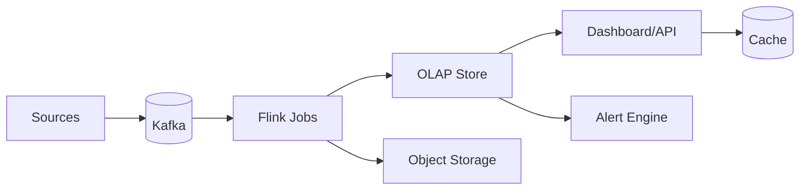

# 📝 Realtime Analytics Pipeline Case Study

## **Problem Statement**

* Build a realtime analytics platform for operational dashboards and alerts with end-to-end latency under seconds.
* Requirements: high-throughput ingestion, exactly-once (or effectively-once) processing for critical metrics, ad-hoc queries, aggregates, rollups, alerting.

---

## **Context & Goals**

* KPIs: end-to-end freshness p95 ≤ 5s (hot path), dashboard query p95 ≤ 300 ms, alert latency ≤ 10s.
* Throughput: ≥ 2M events/sec sustained; multi-tenant isolation.

---

## **Constraints & Decision Drivers**

* Event sources heterogenous; schema evolution; at-least-once sources; cost control for hot/cold paths.

---

## **Step 1: Requirements Clarification**

* Functional: ingestion, schema registry, stream processing, aggregations/windows, storage (hot/warm/cold), alerting, dashboards, backfill.
* Non-functional: horizontal scale, low latency, correctness/duplicates handling, observability.

---

## **Step 2: Back-of-the-envelope Estimation**

* 2M eps × 300 bytes ≈ 600 MB/s raw; replication ×3 → 1.8 GB/s.
* Storage (hot): 2h retention at 600 MB/s ≈ 4.3 TB; compressed ~ 2 TB.
* Query mix: 10k QPS panel fetches; median scan < 50 MB.

---

## **Step 3: System Interface Definition**

* Ingest: POST /ingest (batch) or Kafka producers.
* Query: SQL over OLAP (Pinot/Druid/ClickHouse) or pre-aggregated API.
* Alerts: rule engine (thresholds, anomaly detection) → webhooks/email/pager.

---

## **Step 4: High-Level Design**

* Components: Ingest (Kafka), Schema Registry, Stream Proc (Flink/Spark), OLAP Store (Pinot/Druid/ClickHouse), Cache (Redis), Alerting, Dashboard API.
* Flow: sources → Kafka → Flink windows/joins/UDFs → sink to OLAP (hot) + object storage (cold) → dashboards/alerts read OLAP.

### Architecture Diagram

---

## **Step 5: Database Design**

* Hot OLAP: columnar, time-partitioned segments; inverted indexes; rollups.
* Cold storage: Parquet on object storage; partitioned by date/tenant.
* Schema evolution via registry; backward-compatible fields.

---

## **Step 6: Detailed Component Design**

### Stream Processing
* Exactly-once via checkpoints + transactional sinks; watermark-based windows; dedupe by event_id.

### OLAP Store
* Real-time + offline segments; ingestion tasks; pre-aggregation tables for heavy queries.

### Alerting
* Sliding windows; anomaly detectors (z-score/EWMA); suppress flapping; dedupe.

---

## **Step 7: Bottlenecks & SPOFs**

* Kafka partitions saturation → increase partitions; enable compression; tune acks.
* OLAP segment build backlog → scale ingestion tasks; adjust segment size.

---

## **Step 8: Scaling the Design**

* Scale Kafka brokers/partitions; parallel Flink jobs; OLAP query replicas; result caching.

---

## **Step 9: Monitoring and Alerting**

* Metrics: end-to-end latency, Kafka lag, checkpoint duration, OLAP query p95, ingestion errors.
* Alerts: page on e2e freshness p95 > 5s 10m AND Kafka lag increasing.

---

## **Step 10: Security Considerations**

* Authn/z for API; SASL/TLS for Kafka; PII redaction; row/column-level security for tenants.

---

## **Step 11: Deployment, Migration & Rollout**

* Blue/green Flink jobs; dual-write sinks during migrations; schema version gates.

---

## **Step 12: Reliability (SLIs/SLOs)**

* SLOs: freshness p95 ≤ 5s; query p95 ≤ 300 ms; availability ≥ 99.95%.

---

## **Step 13: Cost & Capacity**

* Drivers: Kafka storage/egress, OLAP compute, object storage.
* Levers: rollup cadence, segment size, compression, cold tiering, cache size.

---

## **Step 14: Testing & Chaos**

* Partition outages; broker loss; checkpoint failure; query surges.

---

## **Runbooks**

* Kafka lag → add consumers, expand partitions, throttle producers.
* OLAP latency → add replicas, warm cache, create aggregate tables.

---

## **Risks & Open Questions**

* Cross-tenant noisy neighbor effects; late data handling policy.

---

## **Tradeoff Summary**

| Decision | Pros | Cons | Alternatives |
|---|---|---|---|
| Exactly-once | Correctness | Complexity/cost | At-least-once + dedupe |
| Pre-aggregations | Low latency | Storage cost | Pure raw scans |

---

## **Real-world References**

* Uber (M3/Pinot), LinkedIn (Apache Pinot), Netflix Keystone.

---

## **Checklist**

* SLOs, capacity, schema policy, runbooks ready.

---

## **Summary**

* Kafka + Flink + OLAP with pre-aggregations delivers sub-second freshness and low-latency queries at scale with predictable cost.
