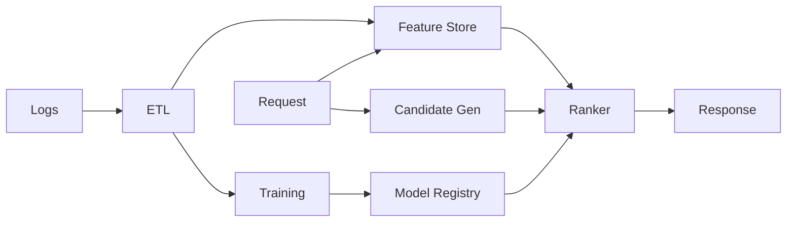

# 📝 Recommendation System Case Study

## **Problem Statement**

* Build a large-scale recommender for homefeed/product recommendations: candidate generation + ranking + re-ranking with personalization.
* Requirements: low-latency online serving, offline training pipeline, feature store, feedback loop.

---

## **Context & Goals**

* KPIs: CTR, conversion rate, dwell time, diversity/novelty; p99 latency ≤ 150 ms; availability ≥ 99.99%.

---

## **Constraints & Decision Drivers**

* Cold-start handling; long-tail items; fairness; exploration vs exploitation.

---

## **Step 1: Requirements Clarification**

* Functional: candidate generation (ANN/graph/co-visitation), ranking (GBDT/DNN), feature store, A/B testing, feedback ingestion, auto-tuning.
* Non-functional: real-time features (< 100 ms freshness), offline batch training, multi-tenant.

---

## **Step 2: Back-of-the-envelope Estimation**

* 200M users; 50 req/user/day → 10B rec requests/day (~115k rps avg; peak 10×).
* Feature vectors: 256–1024 dims; ANN index size TB-scale.

---

## **Step 3: System Interface Definition**

* API: POST /recommend {user_id, context, n} → [{item_id, score, reason}].
* Idempotency by request_id; rate limits; tracing.

---

## **Step 4: High-Level Design**

* Offline: logs → ETL → feature computation → training (GBDT/DNN) → model registry.
* Online: request → retrieve user/item/context features → candidate gen (ANN/graph/co-visitation) → ranker model → business rules → return.

### Architecture Diagram

---

## **Step 5: Data & Models**

* Features: user (demographics/history), item (category/embeddings), context (time/device/location), cross features.
* Candidate gen: ANN over item embeddings (Faiss/ScaNN); graph random-walks; co-visitation.
* Ranking: GBDT or DNN with calibration; re-ranking for diversity; business rules.

---

## **Step 6: Serving & Storage**

* Feature Store: online (Redis/Cassandra) + offline (Parquet). Freshness SLA < 1s for critical counters.
* ANN Index: sharded; IVF/PQ; HNSW; re-build cadence; warm caches.
* Model Serving: low-latency inference service with batching, CPU/GPU selection; canary deploy.

---

## **Step 7: Bottlenecks & SPOFs**

* ANN tail latency → HNSW, better recall/latency tradeoff; caching; two-stage candidates.
* Feature fetch fanout → co-locate feature store; cache hot features; vector cache.

---

## **Step 8: Scaling the Design**

* Partition feature/keyspaces; shard ANN by item_id; autoscale serving by QPS.

---

## **Step 9: Monitoring and Alerting**

* Metrics: p50/95/99 latency; recall@k; CTR lift; feature freshness; model drift; cache hit ratio.
* Alerts: page on p99 > 150 ms 10m; drift beyond threshold.

---

## **Step 10: Security & Privacy**

* PII minimization; consent; data retention; differential privacy for logs; access control on features.

---

## **Step 11: Deployment, Migration & Rollout**

* A/B testing framework; canary; shadow traffic; automatic rollback on KPI regressions.

---

## **Step 12: Reliability (SLIs/SLOs)**

* SLOs: p99 ≤ 150 ms; availability ≥ 99.99%.

---

## **Step 13: Cost & Capacity**

* Drivers: ANN memory/compute, feature store ops, inference CPUs/GPUs.
* Levers: approximate recall, batch size, quantization, caching.

---

## **Step 14: Testing & Chaos**

* Load tests; index corruption injection; feature outage drills.

---

## **Runbooks**

* Latency spike → enable cached fallback candidates; reduce features; increase batch size.
* Drift detected → trigger retraining; rollback model.

---

## **Risks & Open Questions**

* Feedback loop bias; fairness constraints; long-tail quality.

---

## **Tradeoff Summary**

| Decision | Pros | Cons | Alternatives |
|---|---|---|---|
| ANN | Fast recall | Approximate | Brute force (too slow) |
| Two-stage | Low latency | Complexity | Single-stage |

---

## **Real-world References**

* YouTube RecSys, Pinterest, Twitter Home.

---

## **Checklist**

* SLOs, A/B guardrails, feature freshness, runbooks ready.

---

## **Summary**

* Two-stage (candidate + ranker) with a fresh feature store and sharded ANN delivers low-latency, high-quality recommendations at scale.
