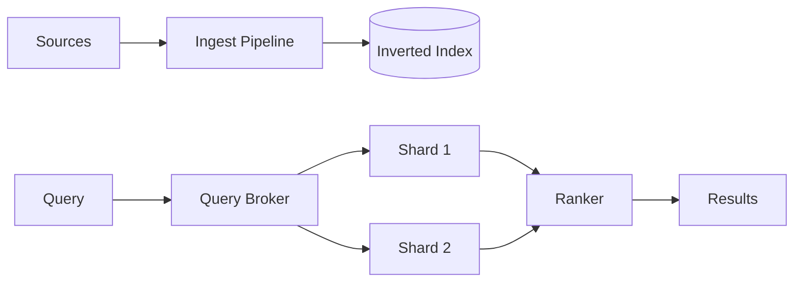

# 📝 Search Engine Case Study

## **Problem Statement**

* Design a web/app search engine: indexing pipeline, query processing, relevance ranking, autosuggest, spell correction, and analytics.
* Requirements: low-query latency, fresh index, high relevance.

---

## **Context & Goals**

* KPIs: p99 query ≤ 200 ms; index freshness ≤ minutes; CTR@1/CTR@k; zero-result rate; cost/query.

---

## **Constraints & Decision Drivers**

* Heterogeneous content; multilingual; typos; synonyms; personalisation.

---

## **Step 1: Requirements Clarification**

* Functional: crawl/ingest, normalize, tokenize, inverted index, ranking, facets, filters, synonyms, spell-check, autosuggest, analytics.
* Non-functional: horizontal scale, multi-tenant, near-real-time updates.

---

## **Step 2: Back-of-the-envelope Estimation**

* Corpus 1B docs; avg 1 KB text; index size ~ 200–300 GB/shard replicated.
* QPS 50k avg; peak 10×; top queries cacheable.

---

## **Step 3: System Interface Definition**

* Query API: q=..., filters, facets, sort; pagination via cursor; explain=true.
* Indexing API: POST /index {doc}; bulk ingest.

---

## **Step 4: High-Level Design**

* Pipeline: ingest → parsing → tokenization → stopwords/stemming → postings lists → ranking signals (BM25 + learned-to-rank) → shards with replicas.

### Architecture Diagram

---

## **Step 5: Index & Ranking**

* Index: term → postings (doc_id, tf, positions); doc store for fields; facets index.
* Ranking: BM25 baseline + LTR model (GBDT) using features: text match, freshness, popularity, personalization.

---

## **Step 6: Query Processing**

* Spell correction; synonyms; query expansion; dynamic pruning; early termination; result caching.

---

## **Step 7: Bottlenecks & SPOFs**

* Hot shards from skewed terms → dynamic re-sharding; replica load-balance; request hedging.
* Slow indexing → pipeline parallelism; bulk flush; segment merging tuning.

---

## **Step 8: Scaling the Design**

* Shard by document_id or term range; replicas for queries; query broker fanout; autosuggest index in memory.

---

## **Step 9: Monitoring and Alerting**

* Metrics: query p95/p99, success rate, zero-results rate, cache hit ratio, indexing lag, segment merge time.
* Alerts: page on p99 > 200 ms 10m AND zero-results spike.

---

## **Step 10: Security & Privacy**

* Access control lists; field-level security; PII redaction; GDPR deletion.

---

## **Step 11: Deployment, Migration & Rollout**

* Rolling shard reloads; blue/green index swaps; canary LTR models.

---

## **Step 12: Reliability (SLIs/SLOs)**

* SLOs: p99 ≤ 200 ms; freshness ≤ 5 min; availability ≥ 99.99%.

---

## **Step 13: Cost & Capacity**

* Drivers: index storage, query CPUs, network; egress for autosuggest.
* Levers: caching, prune depth, segment size, replica count, compression.

---

## **Step 14: Testing & Chaos**

* Load tests with head queries; shard loss drills; index corruption simulations.

---

## **Runbooks**

* Query latency spike → enable hedged requests; increase cache TTL; reduce prune thresholds conservatively.
* Indexing lag → pause heavy merges; increase pipeline workers.

---

## **Risks & Open Questions**

* Personalization vs privacy; multilingual tokenization accuracy.

---

## **Tradeoff Summary**

| Decision | Pros | Cons | Alternatives |
|---|---|---|---|
| LTR | Better relevance | Training complexity | Pure BM25 |
| Shard by doc | Easy ingestion | Query skew risk | Term-based sharding |

---

## **Real-world References**

* Elasticsearch, Solr, Vespa, Algolia.

---

## **Checklist**

* SLOs, index policy, LTR canary, runbooks ready.

---

## **Summary**

* A sharded inverted index with LTR and aggressive query optimizations delivers fast, relevant search with fresh results at internet scale.
