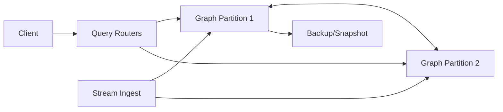

# 📝 Graph Database (Property Graph) Case Study

## **Problem Statement**

* Design a distributed property graph database to support multi-hop traversals (2–6 hops), pattern matching, and real-time recommendations on large, evolving graphs.
* Key requirements and constraints.
* Scale: billions of vertices/edges; high write rate from event streams; low-latency traversals.
* Use cases: social feed ranking, fraud detection, knowledge graph queries.

---

## **Context & Goals**

* Objectives:
  * p99 traversal latency ≤ 300 ms for 3-hop; ≤ 1s for 6-hop.
  * Throughput: ≥ 50k traversals/sec; writes ≥ 200k edges/sec.
  * Availability ≥ 99.99%; online schema evolution; versioned edges.
* SLIs: traversal latency; QPS; write success; replication lag; memory pressure.

---

## **Constraints & Decision Drivers**

* Graph-first access: adjacency locality beats global scans.
* Mixed workload: OLTP traversals + continuous ingestion.
* Consistency: reads may tolerate slight staleness; writes must be durable and ordered per vertex.
* Storage budget: prioritize compression for edge lists.

---

## **Step 1: Requirements Clarification**

* Functional: vertices/edges with labels & properties; Gremlin/PGQL/Cypher-like queries; shortest path; neighborhood queries; subgraph export; snapshot reads.
* Non-functional: horizontal scale, high availability, bounded tail latency.
* Out of scope: heavy global analytics (migrate to Spark/GraphX); full ACID across the entire graph.
* Assumptions: property graph model; eventual global consistency; per-partition ordering.

---

## **Step 2: Back-of-the-envelope Estimation**

* Graph size: 2B vertices, 15B edges; avg edge props 24 bytes; vertex props 64 bytes.
* Storage (logical): edges ~ 360 GB; vertices ~ 128 GB; replication ×3 → ~1.5 TB + indexes.
* Traversal fanout: avg degree 50, power-law; 3-hop explores up to 125k edges worst-case.
* Memory: adjacency lists hot cache ~ 128–256 GB across cluster.

---

## **Step 3: System Interface Definition**

* API: Gremlin/Cypher endpoints; parameterized traversals; prepared patterns.
* CRUD: upsert vertex/edge; batch writes; idempotent edge creation by (src, dst, label, ts).
* Consistency options: snapshot_ts for read; read-your-writes on same partition.
* Rate limits/quotas per tenant.

---

## **Step 4: High-Level Design**

* Components:
  * Query Routers (stateless) – parse, plan, route, cache hot traversals.
  * Graph Partitions – store subgraphs; index-free adjacency; compressed adjacency lists (delta + varint).
  * Metadata/Placement – partition map; replication; balancing; locality hints.
  * Stream Ingest – Kafka → partition writers; dedupe; ordering per vertex.
  * Snapshot/Backup – periodic snapshots; incremental logs; PITR.

* Data flow:
  * Traverse: client → router → start partition → scatter/gather to neighbor partitions → aggregate → respond.
  * Ingest: stream → writer → WAL → apply → update adjacency lists → replicate.

---

## **Step 5: Database Design**

* Model: property graph (labels on vertices/edges; arbitrary properties).
* Partitioning: hash(vertex_id) primary; hybrid with community detection for locality (periodic re-shard).
* Indexes: label + property indexes; secondary inverted indexes; edge-type catalogs.
* Consistency:
  * Per-partition linearizable writes; snapshot reads using hybrid logical clock.
  * Cross-partition traversals use snapshot_ts fence to avoid partial visibility.
* Read/Write paths:
  * Read: start at seed partition; BFS/DFS with budget; remote calls batched; prioritize high-probability neighbors.
  * Write: per-vertex log; adjacency updates; replicate to followers; publish CDC for downstream.

---

## **Step 6: Detailed Component Design**

### Query Router/Planner
* Cost-based planning with statistics (degree distribution); limits on fanout; time/cost budgets.
* Caches common traversals’ results for short TTLs; stores compiled traversals.

### Graph Partition Node
* Stores adjacency lists per vertex; compressed; memory-mapped; bloom filters for edge existence.
* Maintains label/property column families; TSM/LSM for updates; background compaction.

### Ingest Writers
* Ensure per-vertex ordering; idempotency by (src, dst, label, ts); batch to WAL; apply then replicate.

---

## **Step 7: Identifying and Resolving Bottlenecks**

* High-degree hubs → sample edges; cap traversal at hubs; use community-aware expansion.
* Cross-partition chatter → locality-aware partitioning; ghost nodes cache for neighbors.
* Router CPU → offload to compiled traversals; shard routers; cache results.

---

## **Step 8: Scaling the Design**

### Horizontal Scaling
* Increase partitions; re-shard communities; relocate hot vertices.

### Caching Strategy
* Ghost node cache (neighbor summaries) to avoid remote calls; hub cache.

### Load Balancing
* Anycast routers; sticky to starting partition when helpful; health checks.

---

## **Step 9: Monitoring and Alerting**

* Metrics: traversal.p95_ms, router.cpu, hops.remote_ratio, partition.queue_depth, ingest.lag, adjacency.cache_hit.
* Alerts:
  * Page: traversal.p99_ms > 1s for 10m AND hops.remote_ratio > 0.6.
  * Ticket: ingest.lag > 60s for 30m.

---

## **Step 10: Security Considerations**

* Authn/z: OAuth/OIDC; per-tenant graph namespaces; label-level ACLs.
* Privacy: PII tagging; edge redaction at query time; audit logs for traversals.
* Encryption: TLS everywhere; at-rest encryption.

---

## **Step 11: Deployment, Migration & Rollout**

* Rolling upgrades; snapshot-based rebalancing; dual-writes during partition moves.
* Schema evolution for labels/properties with defaults.

---

## **Step 12: Reliability (SLIs, SLOs, Error Budgets)**

* SLIs: traversal latency, success rate, ingest lag, replication lag.
* SLOs: p99 3-hop ≤ 300 ms; 6-hop ≤ 1s; availability ≥ 99.99%.

---

## **Step 13: Cost Model & Capacity Planning**

* Drivers: memory for adjacency, storage for edges, cross-partition RPC.
* Levers: compression (varint/delta), cache size, partition count, precomputations for common paths.

---

## **Step 14: Testing & Chaos**

* Tests: synthetic graphs (power-law) for traversal/tail latency; correctness of snapshot reads.
* Chaos: kill partitions, router overload, network partitions, hot-hub injections.

---

## **Runbooks**

* Tail latency up → enable hedged RPCs; throttle fanout; increase ghost cache.
* Ingest lag → scale writers; throttle sources; prioritize hot partitions.
* Partition hot spots → migrate communities; split partitions.

---

## **Risks & Open Questions**

* Partitioning drift vs community stability.
* Access control at label/property granularity performance.
* Snapshot/time-travel storage overhead.

---

## **Tradeoff Summary**

| Design Decision | Pros | Cons | Alternatives Considered |
|---|---|---|---|
| Hash partitioning | Simple, balanced | Poor locality | Community-based partitioning |
| Snapshot reads | Consistent traversals | Storage overhead | Read-your-writes only |
| Ghost caches | Fewer remote hops | Cache coherency | Always remote fetch |

---

## **Final Architecture Diagram**

---

## **Real-world Examples**

* Neo4j Fabric, JanusGraph + Cassandra, Amazon Neptune, TigerGraph.

---

## **Checklist**

* Traversal plans bounded; partitioning/locality strategy defined.
* Ingest idempotency, ordering, and durability guaranteed.
* Observability, security, and runbooks documented.

---

## **Summary**

* A partitioned property-graph store with index-free adjacency, snapshot reads, and community-aware locality supports low-latency multi-hop traversals and sustained ingestion at scale while keeping operational and cost profiles predictable.
