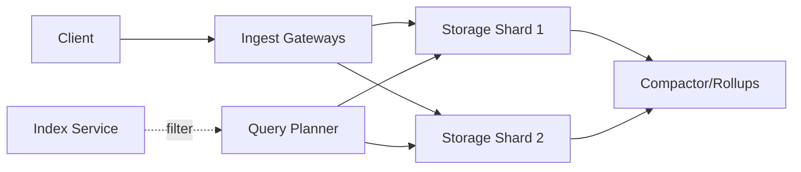

# 📝 Time Series Database (TSDB) Case Study

## **Problem Statement**

* Design a high-ingest, query-efficient time series database for metrics/logs/events with retention, rollups, and low-latency aggregations over recent windows.
* Key requirements and constraints.
* Scale considerations: millions of series, high cardinality tags, bursty writes.
* Example use cases: observability metrics, IoT sensor data, clickstream events.

---

## **Context & Goals**

* Objectives:
  * Sustained ingest ≥ 500k points/sec; burst to 2M pps.
  * p99 query latency ≤ 300 ms for 1h windows; ≤ 2s for 24h windows.
  * Retention: raw 7 days; 5-min rollups 30 days; hourly rollups 13 months.
* SLIs: ingest success rate, backpressure rate, query p95/p99, compaction backlog, storage footprint.

---

## **Constraints & Decision Drivers**

* Multi-tenant with per-tenant quotas.
* High tag cardinality; anti-amplification strategies required.
* Cost: prioritize cheap sequential writes and compression.
* Compliance: PII avoidance; deletion APIs (GDPR-like) with tombstoning.

---

## **Step 1: Requirements Clarification**

* Functional: write API (line protocol/JSON), range queries, group-by tag aggregations, downsampling/rollups, retention, continuous queries, backfill.
* Non-functional: horizontal scalability, high durability, predictable latency, online schema changes.
* Out of scope: ad-hoc joins across tenants; heavy OLAP joins (defer to data warehouse).
* Assumptions: time is provided by client; server normalizes to UTC and validates monotonicity per series.

---

## **Step 2: Back-of-the-envelope Estimation**

* Ingest: 500k pps × 150 bytes/point ≈ 75 MB/s raw; with replication ×3 → 225 MB/s.
* Storage: compression 6× → ~12.5 MB/s stored; daily ~1.08 TB compressed per replica.
* Series cardinality: 50M active series; index for series → memory ~ 2–3 GB per 10M entries.
* Query: typical 1h × 5k series scans; columnar scans ~ few hundred MB per query.

---

## **Step 3: System Interface Definition**

* Ingest endpoints:
  * POST /write (batch) – body: line protocol; up to 10k points per request.
  * Backpressure: 429 with retry-after on shed.
* Query endpoints:
  * GET /query?metric=...&start=...&end=...&agg=...&group_by=tag1,tag2.
  * Pagination via time/page tokens; server-side limit enforcement.
* Idempotency: write id dedupe within 24h per tenant.
* CDC/export: stream to object storage for archival.

---

## **Step 4: High-Level Design**

* Components:
  * Ingest Gateways (stateless) with rate limits and batching.
  * Index Service (series/tag index; inverted index; bloom filters).
  * Storage Nodes (LSM-like time-partitioned, columnar blocks; write-ahead log).
  * Compactor (rollups, dedupe, tombstone GC, block merge).
  * Query Planner/Executor (vectorized aggregations; pushdown to storage nodes).
  * Metadata/Placement (shard map; consistent hashing on series_id).

* Data flow:
  * Client → Gateway → shard by series_id → WAL append → in-memory memtable → flush to time-partitioned blocks → compact/rollup → query scans blocks + index filters.

---

## **Step 5: Database Design**

* Data model: measurement (metric name) + tags (k/v) + timestamp + fields (values).
* Schema: columnar blocks (timestamps, values, tag vectors) per time chunk (e.g., 2h) and shard.
* Sharding: hash(series_fingerprint) across N shards; time-partition per shard.
* Indexing: inverted index for tags; series-id dictionary; bloom filters per block.
* Consistency: at-least-once ingest with dedupe; reads are eventually consistent during compactions.
* Retention: TTL per metric/tenant; tiered storage (hot SSD → warm HDD → cold object store).

---

## **Step 6: Detailed Component Design**

### Ingest Gateway
* Batches small writes; aligns timestamps; validates series cardinality caps.
* Backpressure via 429; token-bucket per tenant.

### Storage Node
* WAL for durability; memtable (append-only); background flush to compressed blocks; LSM-style compactions.
* Rollups computed by Compactor; metadata for block min/max time and tag sketches.

### Query Engine
* Columnar scans; SIMD aggregations; pre-aggregation with rollups; parallel shard fanout; late materialization.

### Index Service
* Tag -> series posting lists; cardinality estimation; bloom per block to skip.

---

## **Step 7: Identifying and Resolving Bottlenecks**

* Hot series (write hotspots) → shard by series_fingerprint; hash salt.
* High cardinality explosions → enforce tag cardinality quotas; cardinality alerts; block-level sketches.
* Compaction backlog → rate limit writes; scale compactor; prioritize recent partitions.
* Query fanout latency → co-locate query planner with storage; cache popular rollups.

---

## **Step 8: Scaling the Design**

### Horizontal Scaling
* Increase shards; consistent rebalancing; tenant pinning for large tenants.

### Caching Strategy
* Result cache for recent rollups (1–5 min TTL); index cache for tag filters; OS page cache for hot blocks.

### Load Balancing
* Anycast gateways; shard-aware routing; hedged requests for tail latency.

---

## **Step 9: Monitoring and Alerting**

* Metrics: ingest.success_rate, ingest.backpressure_rate, wal.sync_ms, flush.backlog, compaction.bytes, query.p95_ms, query.tail_ms, index.miss_ratio, storage.used_bytes.
* Alerts:
  * Page: ingest.backpressure_rate > 2% for 10m AND wal.sync_ms p95 > 50ms.
  * Ticket: compaction.backlog > threshold for 30m.

---

## **Step 10: Security Considerations**

* Authn/z: API keys per tenant; scopes for read/write/admin.
* Encryption: TLS in transit; at-rest encryption; per-tenant buckets for archival.
* PII: avoid; tag/value regex blocks; deletion via tombstones with GC.

---

## **Step 11: Deployment, Migration & Rollout**

* Rolling upgrades; block format versioning; dual-read during upgrades.
* Migration: backfill pipeline; rate-limited; verify checksums.

---

## **Step 12: Reliability (SLIs, SLOs, Error Budgets)**

* SLIs: ingest success, data durability, query latency, freshness (rollup delay).
* SLOs: p99 query ≤ 300 ms (1h); data visible within 5s; availability ≥ 99.95%.

---

## **Step 13: Cost Model & Capacity Planning**

* Drivers: storage, egress (queries, export), compute (compaction, queries), index memory.
* Levers: compression codec, block size, rollup cadence, tiering policy, cache size.
* Headroom: 30–50% on ingest/compaction to absorb spikes.

---

## **Step 14: Testing & Chaos**

* Load tests: ramp ingest to 2M pps; query mixes; retention churn.
* Chaos: kill compactor; slow disks; drop partition; high-cardinality attack.

---

## **Runbooks**

* Backpressure → scale gateways; throttle tenants; inspect WAL fsync.
* Compaction backlog → add compactor nodes; raise I/O; pause rollups temporarily.
* Query latency spike → warm caches; enable hedged requests; prioritize rollup reads.

---

## **Risks & Open Questions**

* Tag cardinality abuse by tenants.
* Rollup accuracy vs storage costs.
* Cross-shard query planning for extreme fanout.

---

## **Tradeoff Summary**

| Design Decision | Pros | Cons | Alternatives Considered |
|---|---|---|---|
| Columnar blocks | Fast scans, high compression | More complex writes | Row store with indexes |
| LSM + WAL | High ingest throughput | Compaction overhead | B-tree with append-only logs |
| Rollups | Faster queries, lower cost | Approximation, complexity | All raw data (expensive) |

---

## **Final Architecture Diagram**

---

## **Real-world Examples**

* Prometheus (remote write), M3DB, ClickHouse time-series, InfluxDB.

---

## **Checklist**

* Ingest, storage, query, compaction paths validated; SLOs and alerts defined.
* Retention/tiering configured; deletion and PII policies in place.
* Cost/tuning levers documented; runbooks ready.

---

## **Summary**

* A shard-partitioned, columnar, LSM-backed TSDB with rollups and inverted tag index meets high-ingest, low-latency querying, and cost goals while controlling cardinality risks and operational complexity.
