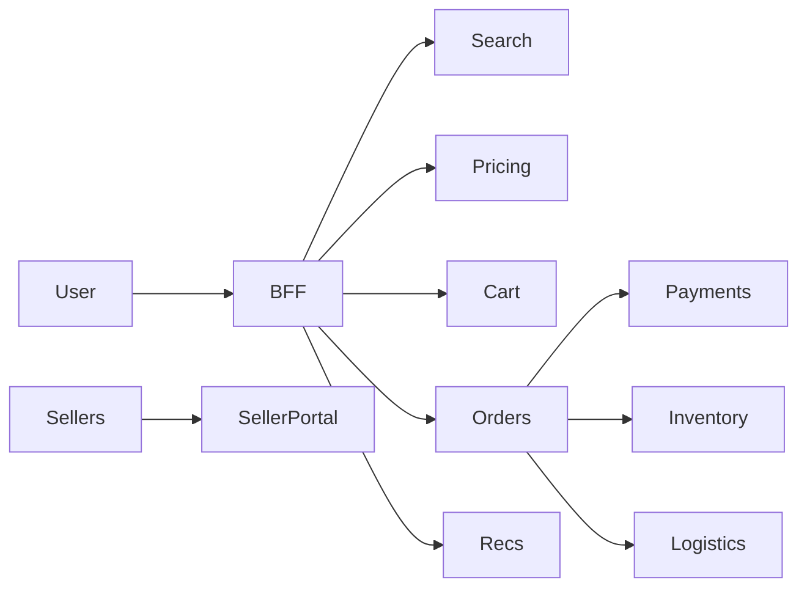

# 📝 Amazon-like E-commerce Case Study

## **Problem Statement**

* Design a marketplace-scale e-commerce platform: 1P/3P sellers, catalog, pricing, carts, checkout, payments, logistics, recommendations, customer service.

---

## **Context & Goals**

* KPIs: availability ≥ 99.99%, checkout p99 ≤ 400 ms, search p99 ≤ 300 ms, fulfillment SLA, cost efficiency.

---

## **Constraints & Decision Drivers**

* Global multi-region, compliance (PCI/GDPR/VAT), sellers onboarding, fraud prevention, peak events (Prime Day).

---

## **Step 1: Requirements Clarification**

* Functional: marketplace (ASIN offers/buy box), catalog, search, pricing/promo, carts, orders, payments, shipping, returns, CS tools, seller portal.
* Non-functional: resiliency, observability, multi-tenant isolation, scalability.

---

## **Step 2: Back-of-the-envelope Estimation**

* DAU 100M; 20 pageviews/day → 2B req/day; peak 20×.
* Catalog 1B items; inventory events 100M/day; orders 10M/day.

---

## **Step 3: System Interface Definition**

* Public APIs for browse/search/orders; internal services; seller APIs for listing/inventory.
* Idempotent order placement; rate limits by tenant.

---

## **Step 4: High-Level Design**

* Domains: Browse/Search, Pricing/Buy Box, Cart/Checkout, Payments/Fraud, Orders/OMS, Inventory, Logistics, CS/Notifications, Recommendations, Seller Services.
* Async bus (Kafka) for events; CQRS for heavy read models; caches/CDN; Sagas for long-running flows.

### Architecture Diagram

---

## **Step 5: Data & Storage**

* Catalog: denormalized docs + search index.
* Offers/Buy Box: per-ASIN pricing/rules; fast cache.
* Orders: RDBMS with sharding; event sourcing for audit.
* Inventory: per-SKU/location; reservations; feeds from WMS.
* Logistics: shipment planning/tracking; integration with carriers.

---

## **Step 6: Detailed Component Design**

### Pricing/Buy Box
* Compute winner by price/availability/seller score/shipping speed; push to cache; recompute on change.

### Payments/Fraud
* PSP orchestration; fraud scoring service; 3DS; chargeback handling; internal ledger and reconciliation.

### Logistics
* Label generation; routing; promised-by dates; delivery estimation; returns workflow.

---

## **Step 7: Bottlenecks & SPOFs**

* Search index hotspots; buy box recomputation storms; payment gateway outages.

---

## **Step 8: Scaling the Design**

* Horizontal services; regional shards; edge caching; pre-computed facets; async projections.

---

## **Step 9: Monitoring and Alerting**

* Metrics: browse/checkout p95/p99, conversion rate, buy box latency, payment success, inventory accuracy.

---

## **Step 10: Security & Compliance**

* PCI network isolation; PII encryption; GDPR delete; seller fraud detection; audit trails.

---

## **Step 11: Deployment, Migration & Rollout**

* Blue/green on BFF; staged rollouts; feature flags.

---

## **Step 12: Reliability (SLIs/SLOs)**

* SLOs: checkout p99 ≤ 400 ms; availability ≥ 99.99%.

---

## **Step 13: Cost & Capacity**

* Drivers: search infra, CDN, payments fees, logistics API calls.
* Levers: cache TTLs, reserved capacity, model offloading to batch where possible.

---

## **Step 14: Testing & Chaos**

* Prime Day drills; PSP outages; inventory spikes.

---

## **Runbooks**

* Buy box storms → rate-limit price updates; batch recomputations; prioritize top ASINs.
* PSP outage → failover to backup PSP; auth-only mode.

---

## **Risks & Open Questions**

* Cross-region inventory reconciliation; seller fraud.

---

## **Tradeoff Summary**

| Decision | Pros | Cons | Alternatives |
|---|---|---|---|
| Sagas | Resilient flows | Complexity | 2PC |
| CQRS | Fast reads | Dual writes | Single DB |

---

## **Real-world References**

* Amazon architecture publications; public talks.

---

## **Checklist**

* SLOs, PCI/GDPR, runbooks ready.

---

## **Summary**

* Domain-aligned services with event-driven projections, robust payments/logistics integration, and global caching deliver a marketplace at scale.
