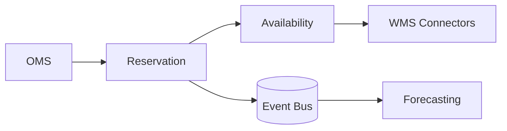

# 📝 Inventory Management Case Study

## **Problem Statement**

* Build a real-time inventory system across multiple warehouses/stores with reservations, backorders, and replenishment signals.

---

## **Context & Goals**

* KPIs: accuracy ≥ 99.9%, reservation success ≥ 99.5%, oversell rate < 0.01%, availability ≥ 99.99%.

---

## **Constraints & Decision Drivers**

* Multi-location stock, latency vs accuracy tradeoffs, WMS/ERP integrations, flash-sale spikes.

---

## **Step 1: Requirements Clarification**

* Functional: stock updates (inbound/outbound), reservations with TTL, releases, allocations, backorders, safety stock, forecasting hooks.
* Non-functional: strong consistency per SKU/location; eventual global views; auditability.

---

## **Step 2: Back-of-the-envelope Estimation**

* 100M SKUs × 100 locations → 10B stock records (sparse); updates 10M/day; reservations peak 200k rps.

---

## **Step 3: System Interface Definition**

* APIs: POST /reserve {sku, qty, location?}, POST /release, POST /adjust, GET /availability.
* Idempotency by reservation_id; conflict code 409 on insufficient stock.

---

## **Step 4: High-Level Design**

* Components: Availability Service, Reservation Service, Allocation Engine, Event Bus, WMS Connectors, Forecasting.
* Data flow: updates/receipts → availability; reservation requests → atomic decrement with TTL; on order completion → finalize; otherwise release expiration.

### Architecture Diagram

---

## **Step 5: Data & Consistency**

* Per (sku, location) record: on_hand, reserved, available = on_hand - reserved.
* Atomic reservation: conditional update (CAS) or transactional decrement; write-ahead log.
* Global view by aggregating per-location; eventual consistency.

---

## **Step 6: Detailed Component Design**

### Reservation
* Hot SKUs partitioned; exponential backoff; queue requests for extreme spikes; TTL on reservations.

### Availability
* Read replicas; cache popular SKUs; CDC to search for store pickup.

---

## **Step 7: Bottlenecks & SPOFs**

* Hot SKUs → shard by SKU; introduce short queues; rate-limit per account.
* WMS lag → buffer adjustments; reconcile nightly.

---

## **Step 8: Scaling the Design**

* Horizontal shards; colocate reservation leaders with traffic regions; follower reads.

---

## **Step 9: Monitoring and Alerting**

* Metrics: reservation p95, conflicts rate, oversell incidents, WMS lag, TTL expirations.

---

## **Step 10: Security & Compliance**

* Authz per seller/location; audit logs; PII minimal.

---

## **Step 11: Deployment, Migration & Rollout**

* Rolling upgrades; dual-writes during schema changes; guardrails.

---

## **Step 12: Reliability (SLIs/SLOs)**

* SLOs: reservation p99 ≤ 150 ms; accuracy ≥ 99.9%; availability ≥ 99.99%.

---

## **Step 13: Cost & Capacity**

* Drivers: hot shard compute, storage; WMS API costs.
* Levers: cache, batching, eventual global view.

---

## **Step 14: Testing & Chaos**

* Flash-sale simulations; partition WMS; clock skew handling.

---

## **Runbooks**

* Conflict spikes → enable queue; increase backoff; split shard.
* WMS lag → enable manual buffer; reconcile.

---

## **Risks & Open Questions**

* Backorder UX; cross-region consistency strategy.

---

## **Tradeoff Summary**

| Decision | Pros | Cons | Alternatives |
|---|---|---|---|
| CAS reservations | Simple, fast | Hot key contention | DB transactions |
| TTL reservations | Prevents oversell | Release delays | Synchronous cancel |

---

## **Real-world References**

* Amazon FBA, Shopify inventory engineering.

---

## **Checklist**

* SLOs, reconciliation, runbooks ready.

---

## **Summary**

* Partitioned reservations with TTL and eventual global aggregation deliver accurate inventory at scale.
