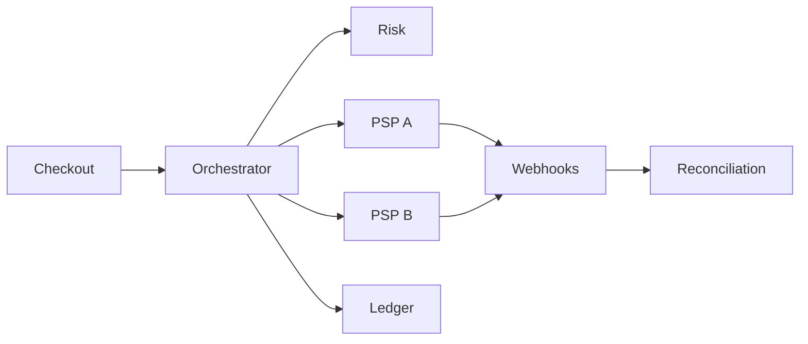

# 📝 Payment Processing Case Study

## **Problem Statement**

* Orchestrate payments across multiple PSPs with authorization, capture, refunds, voids, and reconciliation; support 3DS/SCA and fraud screening.

---

## **Context & Goals**

* KPIs: auth success rate, chargeback rate, refund latency; checkout p99 ≤ 400 ms; availability ≥ 99.99%.

---

## **Constraints & Decision Drivers**

* PCI DSS compliance; multi-currency; regional routing; idempotency; retries; webhooks consistency.

---

## **Step 1: Requirements Clarification**

* Functional: tokenize cards, auth/capture/void/refund, webhooks, ledger, reconciliation, dispute handling, risk engine integration.
* Non-functional: high availability, strong idempotency, observability.

---

## **Step 2: Back-of-the-envelope Estimation**

* 10M orders/day; auth 15M/day; webhook events 30M/day.

---

## **Step 3: System Interface Definition**

* API: POST /authorize, /capture, /refund; idempotency-key; 409 on duplicate; webhooks signed.

---

## **Step 4: High-Level Design**

* Components: Payment Orchestrator, PSP Adapters, Tokenization/Vault, Risk Engine, Ledger, Webhook Receiver, Reconciliation.
* Flow: request → risk pre-check → PSP auth → ledger record → capture on shipment → reconciliation.

### Architecture Diagram

---

## **Step 5: Data & Consistency**

* Idempotent operations with keys; exactly-once ledger writes; PSP retries safe.
* Currency conversions; fees; settlements; dispute states.

---

## **Step 6: Detailed Component Design**

### Orchestrator
* PSP routing by BIN/region; fallback on outage; 3DS challenge handling; token lifecycle.

### Ledger
* Double-entry; immutable journal; events from webhooks; daily close; audit.

### Reconciliation
* Match PSP reports to ledger; discrepancies queue; auto-fix rules.

---

## **Step 7: Bottlenecks & SPOFs**

* PSP outage → failover; hold/capture policy.
* Webhook storms → dedupe; backpressure; idempotent handlers.

---

## **Step 8: Scaling the Design**

* Horizontal adapters; queue-based retries; region-local PSPs.

---

## **Step 9: Monitoring and Alerting**

* Metrics: auth rate by PSP, p95 latency, webhook backlog, ledger write failures, dispute rate.

---

## **Step 10: Security & Compliance**

* PCI segmentation; token vault; HSM/KMS; PII minimization; signed webhooks.

---

## **Step 11: Deployment, Migration & Rollout**

* Canary PSP routing; feature flags for new flows; schema evolution with versioning.

---

## **Step 12: Reliability (SLIs/SLOs)**

* SLOs: checkout p99 ≤ 400 ms; availability ≥ 99.99%.

---

## **Step 13: Cost & Capacity**

* Drivers: PSP fees, chargeback costs, compute for risk; levers: routing, batching captures.

---

## **Step 14: Testing & Chaos**

* PSP outage simulations; webhook duplication; clock skew.

---

## **Runbooks**

* PSP degraded → reroute; switch to auth-only; notify OMS to delay capture.

---

## **Risks & Open Questions**

* SCA friction vs conversion; multi-PSP reconciliation complexity.

---

## **Tradeoff Summary**

| Decision | Pros | Cons | Alternatives |
|---|---|---|---|
| Multi-PSP | Resilience | Integration overhead | Single PSP |
| Ledger | Auditability | Complexity | DB records only |

---

## **Real-world References**

* Stripe, Adyen, Braintree docs and talks.

---

## **Checklist**

* PCI controls, idempotency, reconciliation runbooks ready.

---

## **Summary**

* Redundant PSP routing with a robust ledger and reconciliation yields reliable, auditable payments with minimal downtime impact.
