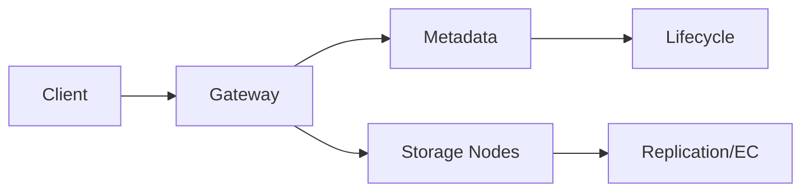

# 📝 Distributed File/Object Storage Case Study

## **Problem Statement**

* Design an S3-like object storage: PUT/GET/LIST, multi-part upload, versioning, lifecycle, durability, and availability across zones/regions.

---

## **Context & Goals**

* Durability ≥ 11×9s, availability ≥ 99.99%, throughput scalable with objects and clients, consistent LIST/HEAD semantics.

---

## **Constraints & Decision Drivers**

* Cost-efficient storage, erasure coding vs replication, consistency model (read-after-write for new objects?), global replication.

---

## **Step 1: Requirements Clarification**

* Functional: buckets, auth, ACLs, PUT/GET/DELETE, LIST with prefixes, multi-part, presigned URLs, lifecycle policies, replication, versioning.
* Non-functional: large object support (TB), high throughput, strong metadata consistency.

---

## **Step 2: Back-of-the-envelope Estimation**

* 10B objects, avg 1 MB; daily ingest 100 TB; peak PUT 100k rps, GET 1M rps.

---

## **Step 3: System Interface Definition**

* S3-compatible API; signed requests; range GETs; multi-part upload.

---

## **Step 4: High-Level Design**

* Components: Frontend Gateways, Metadata Service, Storage Nodes (object shards), Replication/EC service, Lifecycle Manager.

### Architecture Diagram

---

## **Step 5: Data & Consistency**

* Metadata: strongly consistent (Paxos/Raft); object records with locations, versions, ACLs.
* Data: replicated or erasure-coded across zones; background repair; checksums.
* Consistency: read-after-write for new objects; eventual for overwrite by default (configurable).

---

## **Step 6: Detailed Component Design**

### Metadata Service
* Partitioned namespace; Raft per shard; transactions for LIST/PUT semantics; garbage collection for aborted uploads.

### Storage Nodes
* Chunk store; immutable chunks; multi-part assembly; scrubber; repair service.

### Replication/EC
* Policy-based placement; zone/region aware; async cross-region replication.

---

## **Step 7: Bottlenecks & SPOFs**

* Metadata hot partitions → directory hashing; caching; request hedging.
* Repair storms → rate limiting; priority queues.

---

## **Step 8: Scaling the Design**

* Scale gateways horizontally; storage nodes with consistent hashing; metadata shards with rebalancing.

---

## **Step 9: Monitoring and Alerting**

* Metrics: PUT/GET p95/p99, error rates, repair backlog, metadata latency, durability SLI (lost objects = 0).

---

## **Step 10: Security & Compliance**

* Authn/z (SIGv4), bucket policies, encryption at rest (KMS), TLS, audit logs, object lock/legal hold.

---

## **Step 11: Deployment, Migration & Rollout**

* Rolling upgrades; data migration tools; background re-EC; namespace splits.

---

## **Step 12: Reliability (SLIs/SLOs)**

* SLOs: availability ≥ 99.99%; durability target 11×9s; p99 GET ≤ 200 ms for hot objects.

---

## **Step 13: Cost & Capacity**

* Drivers: storage media, cross-zone/region egress, repair bandwidth.
* Levers: EC parameters, tiering, compression, small-object packing.

---

## **Step 14: Testing & Chaos**

* Disk/node/rack/zone failure drills; bit rot injection; network partitions.

---

## **Runbooks**

* Repair backlog surge → add repair workers; throttle client writes; prioritize hot data.

---

## **Risks & Open Questions**

* Small object efficiency; multi-region consistency semantics.

---

## **Tradeoff Summary**

| Decision | Pros | Cons | Alternatives |
|---|---|---|---|
| EC over replication | Lower cost | Higher repair complexity | 3× replication |
| Strong metadata | Simple semantics | Hot shards | Eventual metadata |

---

## **Real-world References**

* Amazon S3, MinIO, Ceph.

---

## **Checklist**

* SLOs, EC policy, repair/runbooks ready.

---

## **Summary**

* A strongly-consistent metadata layer over erasure-coded object shards provides durable, available, and cost-effective storage at scale.
