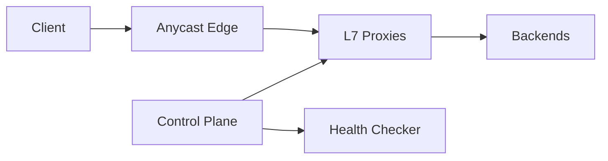

# 📝 Load Balancer Design Case Study

## **Problem Statement**

* Design an L4/L7 load balancer for HTTP/gRPC services with health checks, TLS termination, routing, stickiness, and global traffic management.

---

## **Context & Goals**

* KPIs: p99 added latency ≤ 5 ms (L4) / 10 ms (L7), availability ≥ 99.999%, fast failover < 5s.

---

## **Constraints & Decision Drivers**

* Anycast vs DNS GSLB, consistent hashing, connection reuse, zero-downtime deploys.

---

## **Step 1: Requirements Clarification**

* Functional: health checks, routing (path/host/headers), rate limiting, WAF integration, circuit breaking, retries, blue/green, canary, sticky sessions.
* Non-functional: high throughput, DDoS resilience, observability.

---

## **Step 2: Back-of-the-envelope Estimation**

* 5M rps peak; TLS handshakes 100k/s; backend pool thousands of instances.

---

## **Step 3: System Interface Definition**

* Config API: routes, pools, weights; admin API; metrics endpoints.

---

## **Step 4: High-Level Design**

* Components: Edge (Anycast) → L7 proxies (Envoy/Nginx) → Service discovery → Health checker → Control plane.

### Architecture Diagram

---

## **Step 5: Algorithms & Routing**

* L4: consistent hashing, least-connections; L7: header/path rules; retries with hedging; outlier detection.

---

## **Step 6: Detailed Component Design**

### Health Checks
* Active + passive; ejection policies; slow-start; fail-open/closed modes.

### Control Plane
* Push delta config; versioned; canary rollout; RBAC.

---

## **Step 7: Bottlenecks & SPOFs**

* Control plane outage → last-known-good configs; stateless proxies.
* TLS CPU → offload with TLS session resumption; hardware acceleration optionally.

---

## **Step 8: Scaling the Design**

* Horizontal proxies; shard by region; per-tenant rate limits; autoscale by RPS/CPU.

---

## **Step 9: Monitoring and Alerting**

* Metrics: added latency, 5xx rate, retry rate, ejected hosts, handshake errors.

---

## **Step 10: Security & Compliance**

* mTLS upstream; cert rotation; WAF; rate limits; IP allow/deny; audit logs.

---

## **Step 11: Deployment, Migration & Rollout**

* Canary/blue-green; surge/ramp-down; config drifts detection.

---

## **Step 12: Reliability (SLIs/SLOs)**

* SLOs: availability ≥ 99.999%; added p99 latency ≤ 10 ms.

---

## **Step 13: Cost & Capacity**

* Drivers: egress bandwidth, TLS CPU; levers: keepalive, connection pooling, HTTP/3.

---

## **Step 14: Testing & Chaos**

* Proxy/process crash; BGP withdrawal; burst floods; config rollback drills.

---

## **Runbooks**

* Elevated 5xx → check health ejections; rollback config; disable aggressive retries.

---

## **Risks & Open Questions**

* Sticky sessions vs scalability; global state coordination.

---

## **Tradeoff Summary**

| Decision | Pros | Cons | Alternatives |
|---|---|---|---|
| Anycast | Fast failover | Complex BGP | DNS GSLB |
| Consistent hashing | Affinity | Hotspots | Random/LC |

---

## **Real-world References**

* Envoy, Nginx, HAProxy, Google Maglev.

---

## **Checklist**

* SLOs, config rollback, rate limits, runbooks ready.

---

## **Summary**

* Anycast edge with L7 proxies, strong health checking, and safe control-plane rollouts provides highly available, low-latency load balancing at scale.
