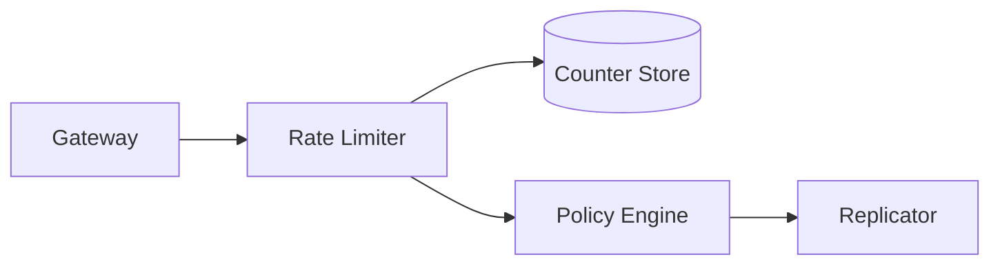

# 📝 Rate Limiter Case Study

## **Problem Statement**

* Provide a distributed rate limiter supporting per-API key/user/IP quotas with burst allowance, sliding windows, and global enforcement.

---

## **Context & Goals**

* KPIs: accuracy ≥ 99.9%, added p99 latency ≤ 2 ms, availability ≥ 99.99%.

---

## **Constraints & Decision Drivers**

* Hot-key protection, consistent enforcement across regions, low latency, failure modes.

---

## **Step 1: Requirements Clarification**

* Functional: token bucket/leaky bucket, sliding window, quotas, headers (X-RateLimit-*), admin API, per-tenant policies, shadow mode.
* Non-functional: highly available, predictable latency, strong observability.

---

## **Step 2: Back-of-the-envelope Estimation**

* 1M rps checks; hot keys 1% of traffic; 10M distinct keys.

---

## **Step 3: System Interface Definition**

* API: CHECK /limit?key=... policy=... → allow/deny, remaining, reset.
* Headers for gateways; async logs for analytics.

---

## **Step 4: High-Level Design**

* Components: Frontend (co-located with gateways), Distributed Counter Store (Redis/Memcached), Policy Engine, Sync/Replicate between regions.

### Architecture Diagram

---

## **Step 5: Algorithms**

* Token Bucket: tokens refill over time; allow if tokens ≥ cost.
* Sliding Window Approx: fixed windows + smoothing; or Redis sorted-sets for exact with higher cost.
* Distributed enforcement: per-region local + periodically synced quotas; or single-writer per key via hashing.

---

## **Step 6: Detailed Component Design**

### Counter Store
* Redis cluster with hash tags; Lua scripts for atomic ops; TTLs for windows; hot-key splitting.

### Policy Engine
* Per-tenant policies; dynamic updates; shadow mode.

---

## **Step 7: Bottlenecks & SPOFs**

* Redis hot shards → shard expansion; local caches; probabilistic pre-checks.
* Cross-region drift → allow small jitter; settle via background reconciliation.

---

## **Step 8: Scaling the Design**

* Co-locate limiter with gateways; connection pooling; pipeline and batch ops.

---

## **Step 9: Monitoring and Alerting**

* Metrics: allow rate, deny rate, p99 latency, Redis CPU, errors; per-tenant dashboards.

---

## **Step 10: Security & Compliance**

* Authn/z for admin; audit logs; per-tenant isolation; PII minimal.

---

## **Step 11: Deployment, Migration & Rollout**

* Gradual rollout: shadow → soft-enforce → hard-enforce; per-tenant toggles.

---

## **Step 12: Reliability (SLIs/SLOs)**

* SLOs: added p99 ≤ 2 ms; availability ≥ 99.99%; accuracy ≥ 99.9%.

---

## **Step 13: Cost & Capacity**

* Drivers: Redis throughput, network; levers: batching, TTL compaction, approximate windows.

---

## **Step 14: Testing & Chaos**

* Hot-key attack; Redis node fail; network partitions.

---

## **Runbooks**

* Redis saturation → scale out; enable pre-check caches; reduce precision.
* False positives → switch to shadow; adjust policy.

---

## **Risks & Open Questions**

* Global exact limits vs latency; tenant fairness.

---

## **Tradeoff Summary**

| Decision | Pros | Cons | Alternatives |
|---|---|---|---|
| Token bucket | Simple, fast | Burst shaping only | Sliding window exact |
| Local+sync | Low latency | Temporary drift | Single-writer per key |

---

## **Real-world References**

* Envoy rate limit service, Stripe global rate limiting.

---

## **Checklist**

* SLOs, shadow mode, hot-key strategy, runbooks ready.

---

## **Summary**

* A co-located, Redis-backed token bucket with regional reconciliation delivers accurate, low-latency rate limiting at scale.
