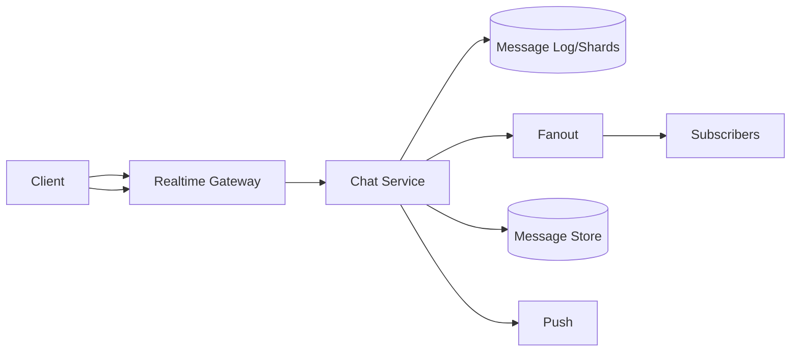

# 📝 Chat Application Case Study

## **Problem Statement**

* Design a real-time chat system with 1:1 and group chats, presence, typing indicators, read receipts, media messages, and push notifications.
* Requirements: low latency, ordered delivery per conversation, durability, scalability.

---

## **Context & Goals**

* KPIs: end-to-end delivery p99 ≤ 150 ms (same region), availability ≥ 99.99%, message loss 0.
* Multi-device sync; offline support; idempotent sends.

---

## **Constraints & Decision Drivers**

* WebSockets/HTTP2 for realtime; mobile networks variability; privacy requirements (E2EE optional).

---

## **Step 1: Requirements Clarification**

* Functional: send/receive, groups, presence, typing, read receipts, media, search, push.
* Non-functional: ordering per conversation, at-least-once delivery with dedupe, scalable fanout.
* Assumptions: regional routing; push via APNS/FCM.

---

## **Step 2: Back-of-the-envelope Estimation**

* DAU 50M; avg 40 messages/day → 2B msgs/day (~23k msgs/sec avg; peak 15×).
* Concurrent connections 5M at peak; fanout varies by group size.

---

## **Step 3: System Interface Definition**

* WebSocket: connect → subscribe to conversation streams; ping/pong for liveness.
* REST: POST /messages, GET /history, POST /receipts.
* Idempotency: client-generated message_id; dedupe per conversation.

---

## **Step 4: High-Level Design**

* Components: Realtime Gateway (WebSocket), Chat Service, Presence Service, Fanout Service, Media Service, Notification Service, Storage (message store), Search/Index.
* Data flow: client → gateway → chat service → append to log → fanout to subscribers → persist; receipts update state; push to offline devices.

### Architecture Diagram

---

## **Step 5: Database Design**

* Message store: partition by conversation_id; ordered append log; TTL for old messages; secondary index for search.
* Presence: KV with expirations; heartbeat updates; fanout to contacts.
* Receipts: per-user per-message state; compacted logs.
* Consistency: per-conversation ordering via single partition leader; at-least-once to clients with dedupe.

---

## **Step 6: Detailed Component Design**

### Realtime Gateway
* WebSocket termination; sticky routing to conversation shards; backpressure; disconnect detection.

### Chat/Fanout
* Append-only per conversation; deliver to connected subscribers; enqueue push for offline; retry with exponential backoff.

### Media
* Pre-signed upload; virus scan; thumbnail; CDN delivery.

---

## **Step 7: Bottlenecks & SPOFs**

* Hot groups → partition large groups across sub-shards; batched delivery; rate limits.
* Connection churn → autoscale gateways; shared-nothing design.

---

## **Step 8: Scaling the Design**

* Shard by conversation_id; virtual nodes; migrate hot shards.
* Use multicast trees for large groups; delta updates for presence.

---

## **Step 9: Monitoring and Alerting**

* Metrics: delivery p95/p99, dropped connections, backlog length, ack latency, presence staleness.
* Alerts: page on delivery p99 > 150 ms 10m AND backlog > threshold.

---

## **Step 10: Security Considerations**

* Authn/z tokens; per-conversation ACLs; E2EE optional (double-ratchet) with server-blind payloads.
* Abuse: spam detection; rate limits; content filters (if not E2EE).

---

## **Step 11: Deployment, Migration & Rollout**

* Rolling deploy gateways; dark traffic for new fanout algorithm; message schema evolution with versioning.

---

## **Step 12: Reliability (SLIs/SLOs)**

* SLOs: p99 delivery ≤ 150 ms; availability ≥ 99.99%; durable storage ≥ 11×9s.

---

## **Step 13: Cost & Capacity**

* Drivers: WebSocket fleet, storage, push notifications.
* Levers: idle timeout, message TTLs, compression, batching.

---

## **Step 14: Testing & Chaos**

* Soak tests with churn; broker/node failure; network partitions.

---

## **Runbooks**

* Backlog growth → scale fanout; slow down publishers; shed large-group sends.
* Connection drops → regional reroute; increase ping interval; investigate ISP issues.

---

## **Risks & Open Questions**

* E2EE indexing/search limitations.

---

## **Tradeoff Summary**

| Decision | Pros | Cons | Alternatives |
|---|---|---|---|
| Per-conversation shards | Preserves order | Hot shards | Global ordering |
| At-least-once + dedupe | Reliable delivery | Client dedupe | Exactly-once (complex) |

---

## **Real-world References**

* WhatsApp, Slack, Discord architecture posts.

---

## **Checklist**

* SLOs, scaling, security, and runbooks documented.

---

## **Summary**

* Sharded conversation logs with realtime fanout deliver low-latency messaging with strong ordering guarantees and reliable delivery at massive scale.
