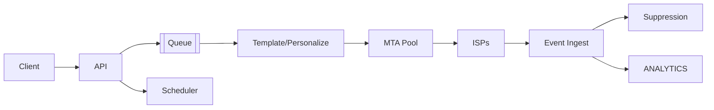

# 📝 Email Delivery System Case Study

## **Problem Statement**

* Build a high-throughput, reliable email delivery platform with APIs, templating, personalization, scheduling, and deliverability features.
* Requirements: rate limiting per tenant/domain, bounce/complaint handling, link tracking, compliance.

---

## **Context & Goals**

* KPIs: acceptance-to-SMTP p95 ≤ 1s; send throughput ≥ 1M msgs/hour; delivery success ≥ 98% (excluding bounces).
* Goals: high deliverability, reputation management, per-tenant isolation.

---

## **Constraints & Decision Drivers**

* ISP throttling, spam filtering, DKIM/SPF/DMARC compliance; regional regulations (CAN-SPAM, GDPR).

---

## **Step 1: Requirements Clarification**

* Functional: APIs, templates/variables, attachments, schedules, webhooks, suppression lists, tracking, segmentation, retries.
* Non-functional: multi-tenant, per-tenant quotas, idempotent requests, observability.

---

## **Step 2: Back-of-the-envelope Estimation**

* 1M msgs/hour ≈ ~278 msgs/sec avg; peak 10× → 2.8k msgs/sec; payload ~ 20 KB avg.
* Storage: logs 30 days; events (deliveries, opens, clicks, bounces) ~ high write volume.

---

## **Step 3: System Interface Definition**

* API: POST /send, POST /batch_send, GET /status/{id}.
* Idempotency: client-supplied send_id; dedupe within 24h.
* Webhooks: deliver, open, click, bounce, complaint.

---

## **Step 4: High-Level Design**

* Components: API Gateway, Templating/Personalization, Scheduler, MTA Pool (SMTP), Reputation Manager, Event Ingest, Suppression Service, Tracking Service, Analytics.
* Data flow: API → queue → template render → enqueue to MTA → SMTP delivery → events back via webhooks/feedback loops → suppression updates.

### Architecture Diagram

---

## **Step 5: Database Design**

* Message metadata store: id, tenant, template, personalization vars; status.
* Suppression lists: per-tenant/domain; fast lookup.
* Tracking: events store (deliver, open, click, bounce); time-series partitioned.
* Reputation: per-IP/domain warmup state; send rates.

---

## **Step 6: Detailed Component Design**

### MTA Pool
* Multiple IP pools; warmup strategies; per-ISP throttles; retry/backoff; batched SMTP.

### Tracking
* Link wrapping; pixel beacons; GDPR consent; bot filtering.

### Suppression
* Hard bounces/complaints → immediate suppression; soft bounces → exponential backoff; TTL-based recovery.

---

## **Step 7: Bottlenecks & SPOFs**

* ISP throttling → adaptive send rates; spread across IPs; regional routing.
* Template rendering CPU → cache compiled templates; batch personalization.

---

## **Step 8: Scaling the Design**

* Horizontally scale MTA workers; shard by tenant; queue depth-driven autoscaling.
* Partition event ingest; stream processing to analytics store.

---

## **Step 9: Monitoring and Alerting**

* Metrics: send throughput, SMTP 2xx rate, bounce/complaint rates, queue latency, per-ISP throttle events.
* Alerts: page on SMTP 2xx rate drop > 20% 10m; ticket on bounce rate > 5%.

---

## **Step 10: Security Considerations**

* Authn/z: API keys per tenant; scopes; HMAC signatures for webhooks.
* Compliance: unsubscribe headers, subscription management, data retention policies.

---

## **Step 11: Deployment, Migration & Rollout**

* Rolling deploy; canary on new MTA settings; reputation warmup scheduler.

---

## **Step 12: Reliability (SLIs/SLOs)**

* SLOs: p95 acceptance ≤ 1s; availability ≥ 99.99%; queue latency p95 ≤ 2s.

---

## **Step 13: Cost & Capacity**

* Drivers: egress bandwidth, compute for MTAs and rendering, analytics storage.
* Levers: batching, compression, template cache, IP pool optimization.

---

## **Step 14: Testing & Chaos**

* ISP failure simulations; feedback loop storms; webhook retries.

---

## **Runbooks**

* Bounce spike → lower send rates; isolate offending tenants; rotate IP pools.
* Webhook backlog → scale ingest; drop duplicate events; increase retry backoff.

---

## **Risks & Open Questions**

* Bot traffic skewing open/click metrics.

---

## **Tradeoff Summary**

| Decision | Pros | Cons | Alternatives |
|---|---|---|---|
| IP warmup | Protect reputation | Slower ramp | Aggressive send (risky) |
| Event wrap | Insightful analytics | Privacy concerns | Minimal tracking |

---

## **Real-world References**

* SendGrid, SES, Mailgun engineering blogs.

---

## **Checklist**

* DKIM/SPF/DMARC, suppression, SLOs, runbooks in place.

---

## **Summary**

* A queued, throttled MTA pipeline with strong reputation management and event-driven suppression achieves high deliverability and reliability at scale.
