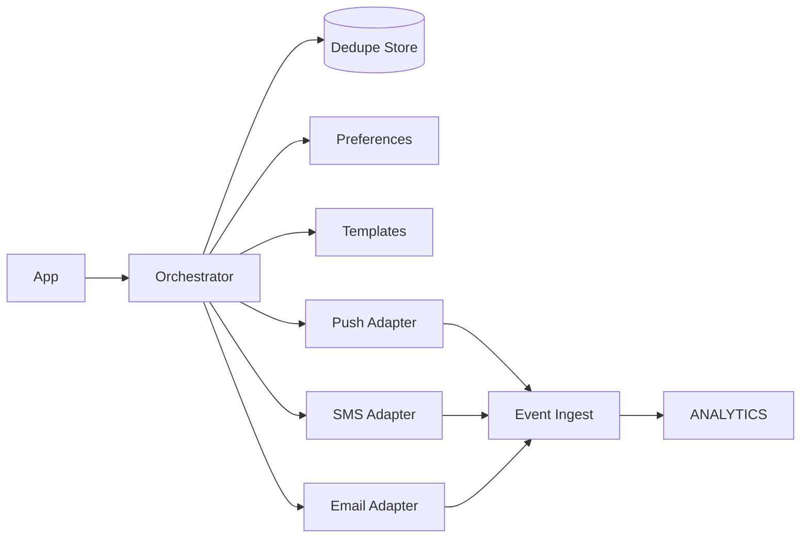

# 📝 Notification System (Multi-Channel) Case Study

## **Problem Statement**

* Design a multi-channel notification system (push, SMS, email, in-app) with user preferences, templating, scheduling, retries, and provider failover.

---

## **Context & Goals**

* KPIs: trigger-to-delivery p95 ≤ 2s; success ≥ 98% (provider dependent); availability ≥ 99.99%.
* Goals: high reliability, dedupe, idempotent triggers, user preference compliance.

---

## **Constraints & Decision Drivers**

* Provider SLAs differ; regional regulations (SMS opt-in, TCPA); quiet hours.

---

## **Step 1: Requirements Clarification**

* Functional: trigger API, templates, preferences, schedules, retries, priorities, A/B tests, throttles, webhooks.
* Non-functional: multi-tenant, per-tenant quotas, observability, dedupe.

---

## **Step 2: Back-of-the-envelope Estimation**

* 200M triggers/day (~2,315 rps avg; peak 15×). Channel mix: push 70%, email 20%, SMS 10%.

---

## **Step 3: System Interface Definition**

* API: POST /notify {user_id, template_id, channel_prefs, data, dedupe_key}.
* Idempotency: dedupe_key per user/template; 24h window.
* Webhooks: delivered, failed; provider-specific.

---

## **Step 4: High-Level Design**

* Components: Orchestrator, Template Service, Preferences Service, Provider Adapters (Push/SMS/Email), Retry/Backoff Scheduler, Dedupe Store, Event Ingest, Analytics.
* Flow: trigger → dedupe → resolve preferences → render template → select providers by channel → send via adapters → handle callbacks → update status/analytics.

### Architecture Diagram

---

## **Step 5: Database Design**

* Dedupe: KV keyed by (user_id, template_id, dedupe_key) with TTL.
* Preferences: per-user/channel; quiet hours; locales.
* Status store: per-notification state machine; retries; provider responses.

---

## **Step 6: Detailed Component Design**

### Orchestrator
* Idempotency, channel selection, priority queues, circuit breakers per provider, retries with exponential backoff and jitter.

### Provider Adapters
* Push: FCM/APNS; tokens; topic sends; collapse keys.
* SMS: multiple aggregators; per-country routing; encoding; DLR handling.
* Email: reuse email system; templating pass-through.

---

## **Step 7: Bottlenecks & SPOFs**

* Provider outage → circuit-break and failover to secondary; degrade to in-app only.
* Preference lookups latency → cache hot users.

---

## **Step 8: Scaling the Design**

* Partition queues per tenant/channel; autoscale workers by queue depth.
* Coalesce duplicate triggers; batch sends where supported (push/email).

---

## **Step 9: Monitoring and Alerting**

* Metrics: trigger latency, success rate per channel/provider, retry rate, queue depth.
* Alerts: page on provider success drop; ticket on queue depth sustained high.

---

## **Step 10: Security Considerations**

* Authn/z: API keys; scopes; rate limits.
* Privacy: PII minimization; encryption; preference consent logs; unsubscribe flows.

---

## **Step 11: Deployment, Migration & Rollout**

* Rolling deploy; canary per provider adapter; feature flags for routing rules.

---

## **Step 12: Reliability (SLIs/SLOs)**

* SLOs: p95 trigger-to-delivery ≤ 2s; availability ≥ 99.99%.

---

## **Step 13: Cost & Capacity**

* Drivers: provider fees (SMS), push free mostly, email cheap; compute for orchestration.
* Levers: dedupe, batching, channel routing, quiet hours to spread load.

---

## **Step 14: Testing & Chaos**

* Provider failure drills; high-burst simulations; idempotency checks.

---

## **Runbooks**

* SMS provider outage → failover to backup; requeue unsent; notify tenants of partial impact.
* High retries → inspect provider throttles; slow down; raise backoff.

---

## **Risks & Open Questions**

* Legal compliance across regions; user preference conflicts.

---

## **Tradeoff Summary**

| Decision | Pros | Cons | Alternatives |
|---|---|---|---|
| Multi-provider | Resilience | Complexity/cost | Single provider (fragile) |
| Dedupe store | Avoid spam | Storage cost | Best-effort dedupe |

---

## **Real-world References**

* AWS SNS, OneSignal, Braze patterns.

---

## **Checklist**

* SLOs, dedupe, provider failover, and runbooks in place.

---

## **Summary**

* An orchestrated, idempotent, multi-channel pipeline with provider failover and preference-aware routing delivers reliable notifications at scale.
