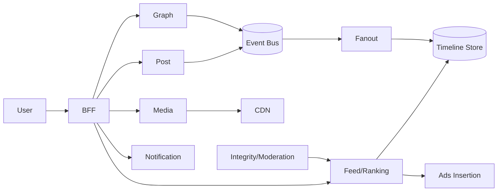

# 📝 Facebook-Scale Social Network Case Study

## **Problem Statement**

* Build a massive-scale social network with profiles, follows/friends, posts (text/media), comments, reactions, sharing, messaging, notifications, and ads.

---

## **Context & Goals**

* KPIs: feed p99 ≤ 250 ms, publish ≤ 500 ms, availability ≥ 99.99%, integrity and privacy compliance, cost per DAU.

---

## **Constraints & Decision Drivers**

* Huge graph; heavy media; integrity (spam/abuse), privacy (GDPR/CCPA); global multi-region; regulation (DSA); A/B experimentation.

---

## **Step 1: Requirements Clarification**

* Functional: profile, graph (friend/follow), post/media, comments/reactions/shares, feed, search, pages/groups, notifications, messaging (separate domain), ads insertion.
* Non-functional: low latency, high availability, hybrid fanout, ranking at scale, moderation and safety.

---

## **Step 2: Back-of-the-envelope Estimation**

* DAU 2B; 8 feed opens/day → 16B feed requests/day (≈185k rps avg; peak 10×).
* Posts 1B/day; reactions 20B/day; comments 5B/day; media uploads 200M/day.

---

## **Step 3: System Interface Definition**

* APIs: /feed, /post, /react, /comment, /follow, /notifications.
* Idempotency for publish/react; rate limits with abuse signals.

---

## **Step 4: High-Level Design**

* Services: Identity/Profile, Social Graph, Post/Media, Feed/Ranking, Engagement (reactions/comments), Notification, Ads/Insertion, Integrity/Moderation, Search, BFF.
* Infra: Kafka event backbone, KV timeline stores, blob storage + CDN, feature store, experimentation platform.

### Architecture Diagram

---

## **Step 5: Data & Models**

* Timelines: hybrid fanout (write for most, read for celebs); cursor pagination; dedupe.
* Ranking: multi-stage – candidate gen → lightweight rank → heavy rank; features from feature store; exploration (MAB) & diversity.
* Graph: adjacency lists; privacy settings; blocking.
* Ads: candidate retrieval; auction; pacing; delivery constraints.

---

## **Step 6: Detailed Component Design**

### Feed/Ranking
* Online inference with cached features; guardrails; timeouts and fallbacks; A/B switches.

### Integrity/Moderation
* ML classifiers (NSFW, hate/violence), rules; action pipeline (downrank/remove/ban); appeals flow.

### Media
* Pre-signed uploads; transcode pipeline (resolutions/codecs); DRM; CDN; prefetch thumbnails.

---

## **Step 7: Bottlenecks & SPOFs**

* Hot creators → switch to fanout-on-read; cache; dedupe; backpressure.
* Feature store latency → colocation; vector cache; degrade features.
* Ads latency → async prefetch; limit auctions per request; fallback creatives.

---

## **Step 8: Scaling the Design**

* Partition timelines by user_id; autoscale feed and fanout; multi-region with home-region stickiness + global CDNs.

---

## **Step 9: Monitoring and Alerting**

* Metrics: feed p95/p99, publish latency, candidate gen latency, feature freshness, integrity actions, ads timeouts.

---

## **Step 10: Security & Privacy**

* PII encryption; GDPR tools (download/delete); granular privacy controls; secure tokens; audit logs.

---

## **Step 11: Deployment, Migration & Rollout**

* Feature flags; canary; guardrail KPIs (CTR/quality/integrity) with auto-rollback.

---

## **Step 12: Reliability (SLIs/SLOs)**

* SLOs: feed p99 ≤ 250 ms; publish ≤ 500 ms; availability ≥ 99.99%.

---

## **Step 13: Cost & Capacity**

* Drivers: CDN egress, inference compute, storage; levers: caching TTLs, model distillation, tiered storage.

---

## **Step 14: Testing & Chaos**

* Traffic surges; CDN failures; model regressions; integrity classifier outages.

---

## **Runbooks**

* Feed tail up → enable cached candidates; relax features; widen TTL; protect hot creators.
* Integrity backlog → raise thresholds temporarily; prioritize severe categories; staff escalation.

---

## **Risks & Open Questions**

* Bias/fairness; misinformation handling at scale; privacy-preserving personalization.

---

## **Tradeoff Summary**

| Decision | Pros | Cons | Alternatives |
|---|---|---|---|
| Hybrid fanout | Balanced scale | Complexity | Pure read/write |
| Multi-stage rank | Quality & speed | Infra cost | Single-stage |

---

## **Real-world References**

* Meta/FB engineering posts on news feed, TAO (graph), Ads auction.

---

## **Checklist**

* SLOs, integrity, privacy tooling, A/B guardrails, runbooks ready.

---

## **Summary**

* Hybrid timelines, multi-stage ranking, strong integrity, and CDN-backed media deliver a safe, low-latency social feed at planet scale.
