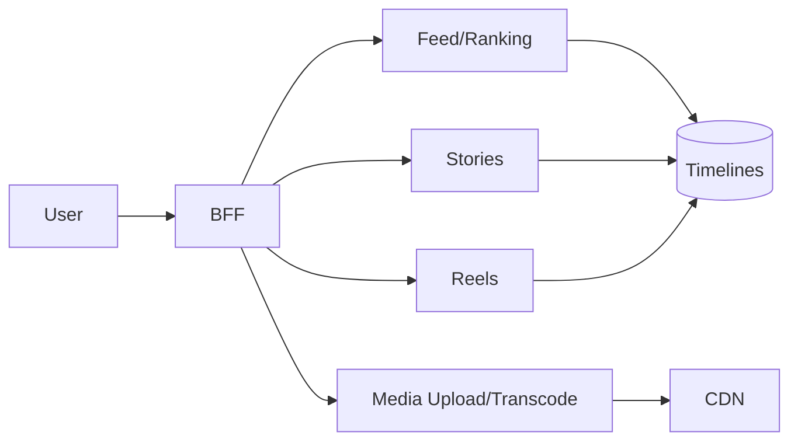

# 📝 Instagram-like Photo/Video Social Network Case Study

## **Problem Statement**

* Design a media-first social platform with posts, stories, reels (short video), comments, reactions, messaging, and notifications.

---

## **Context & Goals**

* KPIs: feed p99 ≤ 250 ms; upload success ≥ 99.9%; story/reel start time ≤ 200 ms; availability ≥ 99.99%.

---

## **Constraints & Decision Drivers**

* Media-heavy; transcode pipeline; ABR streaming; content moderation; copyright (audio/video); global CDN.

---

## **Step 1: Requirements Clarification**

* Functional: profiles, follows, post photo/video, stories (24h), reels (short video), comments/likes, discovery, notifications, messaging.
* Non-functional: low latency playback, efficient upload, moderation, ranking, experimentation.

---

## **Step 2: Back-of-the-envelope Estimation**

* DAU 500M; media uploads 50M/day; story views 10B/day; reels views 5B/day; average asset 10–30 MB.

---

## **Step 3: System Interface Definition**

* APIs: /feed, /stories, /reels, /post, /upload (pre-signed), /react, /comment.

---

## **Step 4: High-Level Design**

* Services: Media Upload/Transcode, Feed/Ranking, Stories, Reels, Discovery, Graph, Notification, BFF.
* Storage: object storage for media; CDN; KV for timelines; search; feature store.

### Architecture Diagram

---

## **Step 5: Media Pipeline**

* Upload to pre-signed URL; virus scan; transcode to multiple bitrates/resolutions; thumbnails; captioning; DRM; publish to CDN with cache warmup.

---

## **Step 6: Ranking/Discovery**

* Multi-objective (engagement, freshness, diversity); signals (watch time, skips, replays). Explore/Discovery powered by ANN over embeddings.

---

## **Step 7: Bottlenecks & SPOFs**

* Transcode backlog → autoscale workers; priority queues; drop long-tail formats.
* CDN misses → prewarm; edge compute for manifests.

---

## **Step 8: Scaling the Design**

* Separate hot (stories/reels) tier; aggressive CDN TTL; edge tokens for region lock; delta updates to timelines.

---

## **Step 9: Monitoring and Alerting**

* Metrics: play start time p95, stall rate, upload latency, transcode queue depth, feed p95, cache hit ratio.

---

## **Step 10: Security & Privacy**

* PII protection; copyright detection; watermarking; age gating; DMCA takedowns; audit trails.

---

## **Step 11: Deployment, Migration & Rollout**

* Feature flags for ranking; video pipeline canary; codec rollouts.

---

## **Step 12: Reliability (SLIs/SLOs)**

* SLOs: start < 200 ms; feed p99 ≤ 250 ms; availability ≥ 99.99%.

---

## **Step 13: Cost & Capacity**

* Drivers: CDN egress, transcoding compute, storage; levers: codec efficiency, ABR ladder tuning, prefetch sizing.

---

## **Step 14: Testing & Chaos**

* CDN region outages; encoder failures; bad manifest pushes.

---

## **Runbooks**

* Video stalls → increase buffer, reduce bitrate ladder, failover CDN.
* Transcode backlog → add workers, drop non-critical renditions.

---

## **Risks & Open Questions**

* Creator monetization; copyright disputes at scale.

---

## **Tradeoff Summary**

| Decision | Pros | Cons | Alternatives |
|---|---|---|---|
| ABR streaming | Smooth playback | More renditions | Single bitrate |
| Pre-signed uploads | Offload BFF | Complexity | Proxy uploads |

---

## **Real-world References**

* Instagram engineering; TikTok/YouTube shorts practices.

---

## **Checklist**

* SLOs, media pipeline guardrails, CDN failover, runbooks ready.

---

## **Summary**

* Media-first design with robust transcode/CDN, hybrid rankings, and careful edge policies delivers fast, reliable stories and reels at scale.
