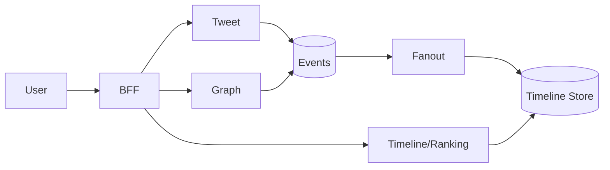

# 📝 Twitter-like Microblogging Case Study

## **Problem Statement**

* Design a microblogging platform with tweet posts, timelines, hashtags, mentions, retweets, likes, search, and notifications.

---

## **Context & Goals**

* KPIs: home timeline p99 ≤ 300 ms, publish ≤ 400 ms, availability ≥ 99.99%, spam minimization.

---

## **Constraints & Decision Drivers**

* Short posts, high fanout, hot accounts, trends, abuse prevention.

---

## **Step 1: Requirements Clarification**

* Functional: post, retweet, like, follow, home timeline, mentions, search, hashtags, notifications.
* Non-functional: hybrid fanout, ranking (recency + quality), moderation.

---

## **Step 2: Back-of-the-envelope Estimation**

* DAU 300M; 5 opens/day → 1.5B timeline requests/day (~17k rps avg; peak 15×).
* Tweets 500M/day; likes 1B/day; retweets 200M/day.

---

## **Step 3: System Interface Definition**

* APIs: /timeline/home, /tweet, /retweet, /like, /follow, /notifications.
* Idempotency for tweet/retweet; rate limits.

---

## **Step 4: High-Level Design**

* Services: Tweet, Timeline/Ranking, Graph, Engagement, Notification, Search, BFF.
* Infra: Kafka, KV timeline store, object storage for media, CDN, abuse filters.

### Architecture Diagram

---

## **Step 5: Timelines**

* Fanout-on-write for typical users; fanout-on-read for hot accounts; merge by recency/quality; dedupe; cursor paginate.

---

## **Step 6: Ranking & Trends**

* Rank by recency, quality signals, diversity; trends via streaming counts (windowed), topic clustering.

---

## **Step 7: Bottlenecks & SPOFs**

* Hot accounts → throttle & switch to read fanout; protect via queues.
* Hashtag storms → shard counters; cap per-source.

---

## **Step 8: Scaling the Design**

* Partition timelines by user_id; autoscale fanout workers; precompute for frequent openers.

---

## **Step 9: Monitoring and Alerting**

* Metrics: p95/p99 timeline latency, fanout backlog, tweet publish latency, abuse signals.

---

## **Step 10: Security & Abuse**

* OAuth/JWT; spam/abuse filters; rate limits; shadow bans for bots; user controls.

---

## **Step 11: Deployment, Migration & Rollout**

* Shadow write new timeline store; canary ranking; reversible flags.

---

## **Step 12: Reliability (SLIs/SLOs)**

* SLOs: home p99 ≤ 300 ms; publish ≤ 400 ms; availability ≥ 99.99%.

---

## **Step 13: Cost & Capacity**

* Drivers: KV storage, event bus, CDN; levers: cache TTL, hybrid fanout policy, cold timeline tiering.

---

## **Step 14: Testing & Chaos**

* Celebrity surges; hashtag storms; bot floods.

---

## **Runbooks**

* Fanout backlog → prioritize recent followers; switch hot creator to read-fanout; enable shedding.

---

## **Risks & Open Questions**

* Echo chambers; abuse and legal compliance; rank transparency.

---

## **Tradeoff Summary**

| Decision | Pros | Cons | Alternatives |
|---|---|---|---|
| Hybrid fanout | Balanced scale | Complexity | Pure strategies |
| Simple rank | Fast | Quality loss | Heavy ML |

---

## **Real-world References**

* Twitter timelines; public architecture talks.

---

## **Checklist**

* SLOs, abuse controls, runbooks ready.

---

## **Summary**

* Hybrid fanout, simple-but-effective ranking, and robust abuse protection deliver responsive timelines under heavy fanout pressures.
