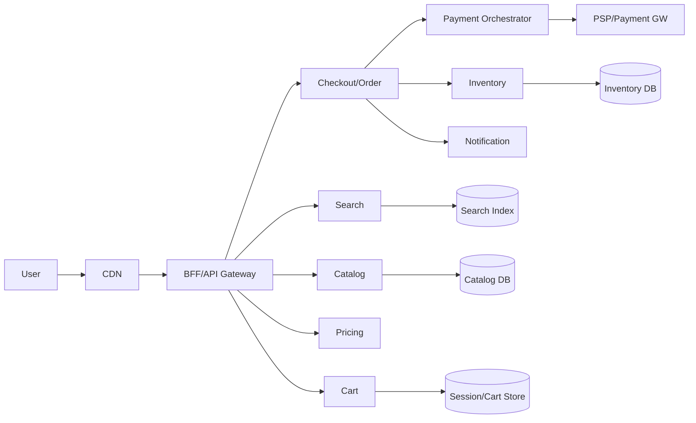

# 📝 E-commerce Website Case Study

## **Problem Statement**

* Design a large-scale e-commerce website supporting product discovery, shopping cart, checkout, orders, payments, and fulfillment.
* Requirements: fast catalog browsing/search, reliable checkout, resilient payments, real-time inventory, promotions.
* Scale: millions of DAU, seasonal peaks (10–30×), global audience.
* Use cases: browse/search, view product, add to cart, checkout, pay, track order.

---

## **Context & Goals**

* Objectives/KPIs:
  * p99 API latency: browse/search ≤ 300 ms; checkout ≤ 400 ms.
  * Availability ≥ 99.99% (core flows), error rate ≤ 0.1%.
  * Cart persistence across devices; idempotent checkout.
  * Cost efficiency during non-peak periods.

---

## **Constraints & Decision Drivers**

* Global users; GDPR/CCPA; PCI scope isolated to payment edges.
* High read-to-write skew; flash-sales cause inventory contention.
* SEO and fast first paint → CDN + edge caching.

---

## **Step 1: Requirements Clarification**

* Functional: catalog, search, PDP, cart, checkout, payments, orders, returns, tracking, reviews.
* Non-functional: availability, low latency, consistency for inventory and payment, observability.
* Out of scope: warehouse robotics; ad tech.
* Assumptions: third-party PSPs; OMS/WMS integrations.

---

## **Step 2: Back-of-the-envelope Estimation**

* DAU 10M; 10 pageviews/user/day → 100M requests/day ~ 1,157 rps avg; peak 15× → 17k rps.
* Add-to-cart 2M/day; checkout 300k/day; orders 200k/day.
* Catalog size 10M SKUs; product doc ~ 2 KB; index ~ 80 GB.
* Inventory events 5M/day; payment events 1M/day.

---

## **Step 3: System Interface Definition**

* APIs: /search, /products/{id}, /cart, /checkout, /orders.
* Errors: 4xx validation; 409 conflicts (inventory); 5xx transient.
* Versioning: v1/v2; backward compatible.
* Idempotency: header for checkout/order placement; dedupe window 24h.
* Rate limits: IP/user-based; burst vs steady-state.

---

## **Step 4: High-Level Design**

* Components: API Gateway/BFF, Web/App, Catalog Service, Search Service (ES/Opensearch), Cart Service, Pricing/Promotions, Checkout/Order Service, Payment Orchestrator, Inventory Service, Shipping/Tracking, Notification, CDN.
* Data flow: client → BFF → microservices; async events via Kafka; caches (CDN/edge + Redis) for hot reads; RDBMS for orders/payments; NoSQL for catalog/cart.

### Architecture Diagram

---

## **Step 5: Database Design**

* Catalog: document store (denormalized product, variants, facets); search index maintained via CDC.
* Cart: key-value per user/session; TTL; merge on login.
* Orders: relational (ACID), order lines, payments, shipments; ledger for payment transactions.
* Inventory: per-SKU per-location stock; reservations with TTL; eventual consistency to read replicas.
* Consistency: inventory reservation strong within partition; order placement idempotent saga.

---

## **Step 6: Detailed Component Design**

### Search
* Index shards by product/category; autosuggest; synonym handling; ranking; caching popular queries.

### Checkout/Order
* Saga steps: reserve inventory → authorize payment → create order → capture payment → release reservation.
* Compensation: release inventory, void authorization on failure; retries with idempotency key.

### Payment Orchestrator
* PSP adapters; 3DS flows; webhooks; reconciliation to internal ledger.

### Inventory
* Reservation records with TTL; anti-oversell guards; event stream to WMS.

---

## **Step 7: Bottlenecks & SPOFs**

* Search overload → cache and warm top queries; add replicas; precompute facets.
* Inventory contention → partition by SKU/location; exponential backoff; queue hot SKUs.
* Payment spikes → queue authorizations; graceful degradation for non-critical flows.

---

## **Step 8: Scaling the Design**

* Horizontal scale stateless services; autoscaling by QPS and queue depth.
* CDN/edge caching for static/dynamic content; cache bust on updates.
* Read replicas and CQRS for orders history.

---

## **Step 9: Monitoring and Alerting**

* Metrics: p95/p99 latencies per endpoint, error rate, cache hit ratio, search QPS, payment auth success, inventory reservation failures.
* Alerts: page on checkout p99 > 400 ms 10m AND error_rate > 2× baseline; ticket on search hit ratio < 80% 30m.

---

## **Step 10: Security Considerations**

* Authn/z: OAuth/JWT; scopes per operation; CSRF protection.
* PCI: isolate card data with tokenization; vault; PCI segment.
* PII: encryption at rest; GDPR deletion; audit logs; rate limits.

---

## **Step 11: Deployment, Migration & Rollout**

* Blue/green BFF; rolling services; feature flags for checkout changes.
* Schema migrations online; backfills throttled; dual-writes for transitions.

---

## **Step 12: Reliability (SLIs/SLOs)**

* SLIs: endpoint latencies, availability, payment success, inventory accuracy.
* SLOs: browse p99 ≤ 300 ms; checkout p99 ≤ 400 ms; availability ≥ 99.99%.

---

## **Step 13: Cost & Capacity**

* Drivers: search replicas, CDN egress, RDBMS IOPS, PSP fees.
* Levers: cache TTLs, index shard count, reserved instances, autoscaling.

---

## **Step 14: Testing & Chaos**

* Load tests for Black Friday; fault injection on PSP failures; inventory oversell simulations.

---

## **Runbooks**

* Checkout errors spike → check PSP status, switch providers, reduce capture to auth-only, extend reservation TTL.
* Search latency up → add replicas, raise cache TTL, disable expensive facets.

---

## **Risks & Open Questions**

* Multi-region consistency for inventory.
* Fraud prevention integration timeline.

---

## **Tradeoff Summary**

| Decision | Pros | Cons | Alternatives |
|---|---|---|---|
| Saga checkout | Resilient, modular | Complexity | Centralized TX (2PC) |
| KV carts | Low latency, scale | Session merge logic | RDBMS session table |
| Search index | Fast retrieval | Index lag | DB-only text search |

---

## **Real-world References**

* Amazon retail architecture talks, Shopify engineering blog, Etsy search papers.

---

## **Checklist**

* SLOs, capacity, PCI, GDPR, runbooks in place.

---

## **Summary**

* Microservices + CDN + search index + order/payment orchestration meet scale and reliability goals while controlling costs and complexity.
