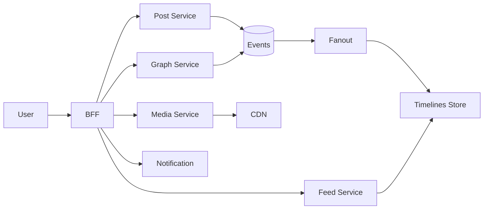

# 📝 Social Media Platform Case Study

## **Problem Statement**

* Design a large-scale social platform with user profiles, posting, timelines, media, reactions, and notifications.
* Requirements: low-latency feed, reliable media uploads, scalable fanout, abuse prevention.
* Scale: hundreds of millions of DAU, global.

---

## **Context & Goals**

* KPIs: feed p99 ≤ 250 ms; post publish ≤ 500 ms; availability ≥ 99.99%; cost per 1k requests.
* Goals: relevant, fresh feed; consistent engagement metrics; safe content.

---

## **Constraints & Decision Drivers**

* Graph relationships drive feed; heavy media; spam/abuse controls; legal (GDPR/DMCA).

---

## **Step 1: Requirements Clarification**

* Functional: profile, follow, post text/media, comments, likes, shares, notifications, search.
* Non-functional: low latency, high availability, de-duplication, idempotent publish.
* Assumptions: mobile-first; push notifications; CDN for media.

---

## **Step 2: Back-of-the-envelope Estimation**

* DAU 200M; 10 feed opens/day → 2B feed requests/day (~23k rps avg; peak 15×).
* Posts 100M/day; reactions 2B/day; media uploads 20M/day; average media 5–20 MB.

---

## **Step 3: System Interface Definition**

* APIs: /feed, /post, /media/upload, /react, /follow, /notifications.
* Idempotency: publish token for posts; reaction idempotency per user-post.
* Rate limits per user; abuse throttles.

---

## **Step 4: High-Level Design**

* Services: User Graph, Post, Media, Feed, Reaction, Notification, Search, Abuse/Trust & Safety, BFF.
* Async backbone: Kafka for events (post, follow, reaction) → fanout, counters, search, ranking.
* Storage: Post content store (NoSQL), Graph store (edges), Counters store, Search index, Blob storage for media.

### Architecture Diagram

---

## **Step 5: Database Design**

* Timelines: two strategies
  * Fanout-on-write (precompute recipient timelines into KV lists) – fast reads, heavy writes.
  * Fanout-on-read (compute feed at read time) – cheaper writes, slower reads.
* Use hybrid: heavy creators → fanout-on-read; normal users → fanout-on-write.
* Graph: adjacency lists; follow/unfollow events; consistent counters.
* Counters: sharded counters for likes/comments; CRDTs for eventual merge.

---

## **Step 6: Detailed Component Design**

### Feed Service
* Ranking model features: recency, affinity, content quality, diversity; cached scores with TTL.
* Pagination via cursor; dedupe; hide blocked content.

### Media Service
* Upload to pre-signed URL; processing pipeline (transcode, thumbnail, moderation, DRM); store in object storage; serve via CDN.

### Notification
* Preference-aware fanout; rate limits; channels (push, email, SMS).

---

## **Step 7: Bottlenecks & SPOFs**

* Hot accounts → protect with fanout-on-read; cache; sampling.
* Counter contention → sharded counters, eventual aggregation.
* Storage hotspots → consistent hashing + virtual nodes.

---

## **Step 8: Scaling the Design**

* Stateless BFF/Feed; autoscale by QPS.
* Timeline store: partition by user_id; tier cold timelines to cheaper storage.
* Search index replicas; async rebuilds.

---

## **Step 9: Monitoring and Alerting**

* Metrics: feed p95/p99, publish latency, media processing time, timeline write/read QPS, cache hit ratio, abuse signals.
* Alerts: page on feed p99 > 250 ms 10m AND error_rate > 2×; ticket on media backlog.

---

## **Step 10: Security Considerations**

* Authn/z: OAuth/JWT; scope per action; device trust.
* Privacy: PII encryption; GDPR deletion; blocklists; age gating.
* Abuse: rate limits, anomaly detection, moderation pipeline.

---

## **Step 11: Deployment, Migration & Rollout**

* Feature flags; canary release for ranking changes; shadow read/write for timeline strategies.

---

## **Step 12: Reliability (SLIs/SLOs)**

* SLOs: feed p99 ≤ 250 ms; publish ≤ 500 ms; availability ≥ 99.99%.

---

## **Step 13: Cost & Capacity**

* Drivers: CDN egress, storage for media, compute for fanout; ranking compute.
* Levers: cache TTLs, fanout policy, media quality ladder, reserved instances.

---

## **Step 14: Testing & Chaos**

* Load tests for fanout surges; fault injection for media/CDN; abuse simulations.

---

## **Runbooks**

* Feed latency spike → widen cache TTL, reduce ranking features, enable fanout-on-read for hot creators.
* Media backlog → autoscale transcoders; shed long-tail formats.

---

## **Risks & Open Questions**

* Ranking fairness vs engagement; privacy compliance for recommendations.

---

## **Tradeoff Summary**

| Decision | Pros | Cons | Alternatives |
|---|---|---|---|
| Hybrid fanout | Balanced load | Complexity | All write or all read |
| Sharded counters | Scale | Approximate intermediate states | Global locks |

---

## **Real-world References**

* Meta engineering (news feed), Twitter timelines, Pinterest homefeed.

---

## **Checklist**

* SLOs, abuse controls, privacy policies, runbooks ready.

---

## **Summary**

* Hybrid timelines, CDN-based media, and robust fanout/ranking pipelines deliver low-latency feeds at large scale with manageable cost.
