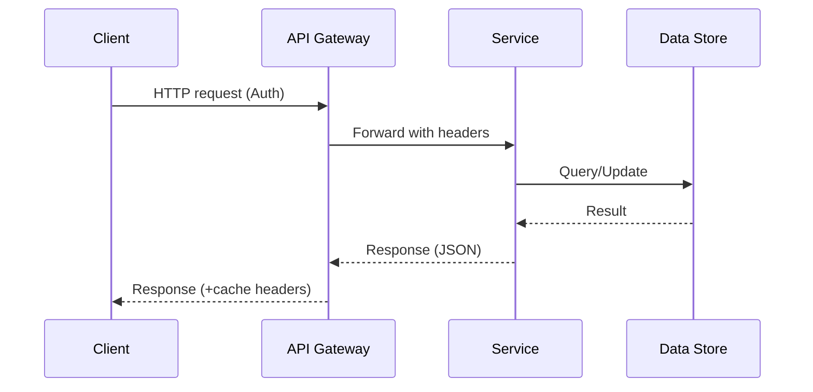

# Client-Server Architecture

## 0) Metadata
- **Name**: Client-Server Architecture
- **Canonical Path**: Patterns/001_Fundamentals/Basics/Client_Server_Architecture.md
- **Category**: 001 Fundamentals
- **Status**: Stable
- **Last Updated**: YYYY-MM-DD
- **Tags**: networking, http, separation-of-concerns

---

## 1) TL;DR (Executive Summary)
- **Problem**: Directly coupling users with data/computation creates scalability, security, and operability issues.
- **Solution (essence)**: Separate requesters (clients) from providers (servers) via a stable request/response interface over a network.
- **Use when**: Many users access shared data/services; need centralized control, consistency, or sharing.
- **Avoid when**: Purely local apps; intermittent networks where peer-to-peer or offline-first is preferable.
- **Key tradeoff**: Centralization (control, consistency) vs. potential single-point bottlenecks.

---

## 2) Problem & Context
- Users/devices need access to shared compute and data.
- Direct file/database access from endpoints causes security, versioning, and integrity problems.
- Business needs observability, throttling, and evolution without breaking clients.

## 3) Decision Drivers
- SLOs: p99 latency ≤ target; availability ≥ 99.9%+
- Scale: N clients, QPS, concurrency; burst behavior.
- Constraints: Platform, network variability, security/compliance.
- Cost: Central infra vs. edge compute; ops headcount.

---

## 4) Intuition & Baseline
- Naive: Each client reads/writes shared state directly (files/DB).
- Fails: No authz boundaries, brittle coupling, race conditions, poor caching.
- Insight: Interpose a service that validates, mediates, and scales.

---

## 5) The Pattern (Optimized Approach)
- **Core Concept**:
  - Clients call servers over well-defined APIs (often HTTP/HTTPS).
  - Servers encapsulate business logic and storage access.
  - Stateless interactions simplify scaling via horizontal replicas.
- **Happy-path flow**:
  1. Client sends request (with authn/z) to service endpoint.
  2. Service validates, executes business logic, accesses storage.
  3. Service returns response (status, data) to client.
- **Degraded/Failure mode**: Retries with backoff, circuit breakers, partial fallbacks, cached responses.

---

## 6) Architecture
### 6.1 Flow Diagram
```mermaid
flowchart LR
  U[Client] -->|HTTP(S) request| GW[(API Gateway/LB)]
  GW --> S1[Service Instance]
  GW --> S2[Service Instance]
  S1 --> DS[(Data Store)]
  S2 --> DS
  S1 -.-> C[(Cache)]
  S2 -.-> C
  C --> DS
```

### 6.2 Sequence (Optional)


### 6.3 Components
- Client (browser/app), API gateway/load balancer, service replicas, cache, database/queue.
- Trust boundaries: public edge vs. private service network.

---

## 7) Interfaces
### 7.1 API Contracts (example)
```
GET /v1/resources/{id}
Authorization: Bearer <token>

200 OK { "id": "...", "name": "..." }
404 Not Found { "error": "...", "traceId": "..." }
```
- Idempotency for GET/PUT/DELETE; POST may require idempotency keys.
- Pagination: `limit`, `cursor`.
- SLAs: Advertise latency/availability; rate limits.

### 7.2 Events & Schemas
- Optional async events for changes; topics, ordering, retries.

---

## 8) Data Model & Storage
- Entities behind the service; indexes to match API access paths.
- Partitioning strategy for scale; cache keys and TTLs.
- Backups and restore objectives.

---

## 9) Properties & Guarantees
- Scalability: Horizontal via stateless replicas and shared-nothing.
- Availability: Multi-AZ, health checks, failover.
- Consistency: Typically strong within a request; cross-request depends on storage.
- Latency: Edge termination + caching to reduce tail.
- Fault Tolerance: Retries with jitter, circuit breakers, timeouts.
- Complexity: Moderate; grows with features and dependencies.

---

## 10) Tradeoffs
| Aspect | Pros | Cons | Notes |
|---|---|---|---|
| Performance | Edge caching, pooling | Network overhead | Optimize payloads, CDN |
| Scalability | Stateless replicas | Shared DB hotspots | Shard, CQRS |
| Availability | Central control | SPOF risks | Redundancy, LB |
| Consistency | Enforced in service | Distributed writes | Use transactions/pragmatic CRDTs |
| Cost | Multi-tenant efficiency | Central infra costs | Autoscale, right-size |
| Complexity | Encapsulation | More moving parts | Standardize platform |
| Operability | Observability | On-call overhead | SLOs, runbooks |
| Security | Central authz | Attack surface | mTLS, WAF, least privilege |

---

## 11) Implementation Guide
- Dependencies: TLS, identity provider (OIDC), logging/metrics.
- Infra: Gateway/LB, service mesh (optional), caches, DB.
- Defaults: timeouts 200–1000ms, retries (2) with jitter, connection pooling.
- Minimal example:
```python
# Example (Flask-style)
from flask import Flask, request, jsonify
app = Flask(__name__)

@app.get('/v1/resources/<rid>')
def get_resource(rid):
    # validate auth (omitted)
    # fetch from cache/db (omitted)
    return jsonify({"id": rid, "name": "example"}), 200
```

---

## 12) Common Pitfalls & Edge Cases
- Thundering herd on cache miss; add jittered backoff, request coalescing.
- Overly chatty clients; batch/aggregate.
- Leaking internal errors; sanitize responses, add trace IDs.
- Missing idempotency; duplicate POSTs on retries.

### Edge-case Checklist
- Cold start/warm-up, health checks, slow starts.
- Backpressure and overload protection.
- Idempotent semantics where needed.
- Schema versioning and compatibility.

---

## 13) Resilience & Recovery
- Failure modes: node crash, DB failover, partial network.
- Degradation: serve stale, read-only mode, feature flags.
- Recovery: restart order, replay cues, cache warmers.

---

## 14) Observability
- Metrics: latency, error rate, saturation, cache hit ratio.
- SLOs: p99 ≤ X ms; availability ≥ Y%.
- Alerts: sustained p99 breaches + error spikes; low hit ratio.
- Tracing: propagate correlation IDs.

---

## 15) Capacity & Sizing
- QPS × avg latency ≈ concurrency; size thread/conn pools.
- Cache working set sizing; DB IOPS limits.
- Headroom 30–50%; autoscaling signals.

---

## 16) Security & Compliance
- Authn/z at the edge; mTLS service-to-service.
- Input validation; rate limiting; WAF.
- Data protection in transit/at rest.

---

## 17) Deployment, Versioning & Migration
- Blue/green or canary; backward-compatible API changes.
- Deprecation policy; API versioning.

---

## 18) Testing & Verification
- Contract tests; load tests; chaos (LB, DB failover).
- DR drills for region/AZ loss.

---

## 19) Cost Model
- Drivers: compute, egress, DB, CDN.
- Levers: cache TTLs, compression, pooling, autoscaling.

---

## 20) Runbooks
- Elevated errors: check gateway, dependency health, rollbacks.
- Latency spikes: inspect tail, hot keys, GC pauses.

---

## 21) Variants, Alternatives & Related Patterns
- 3-tier (web/app/db), Microservices, BFF, API Gateway, Service Mesh.
- Alternatives: P2P, offline-first sync.

---

## 22) Practice Scenarios
- Design a simple CRUD service with 5k QPS, p99 300ms, 99.9%.

---

## 23) References
- TANENBAUM, Computer Networks; RFC 7231; REST papers/blogs.
