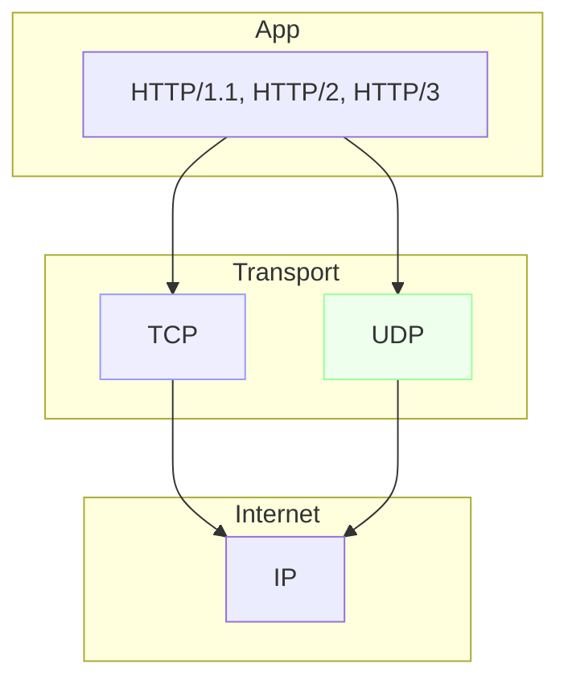
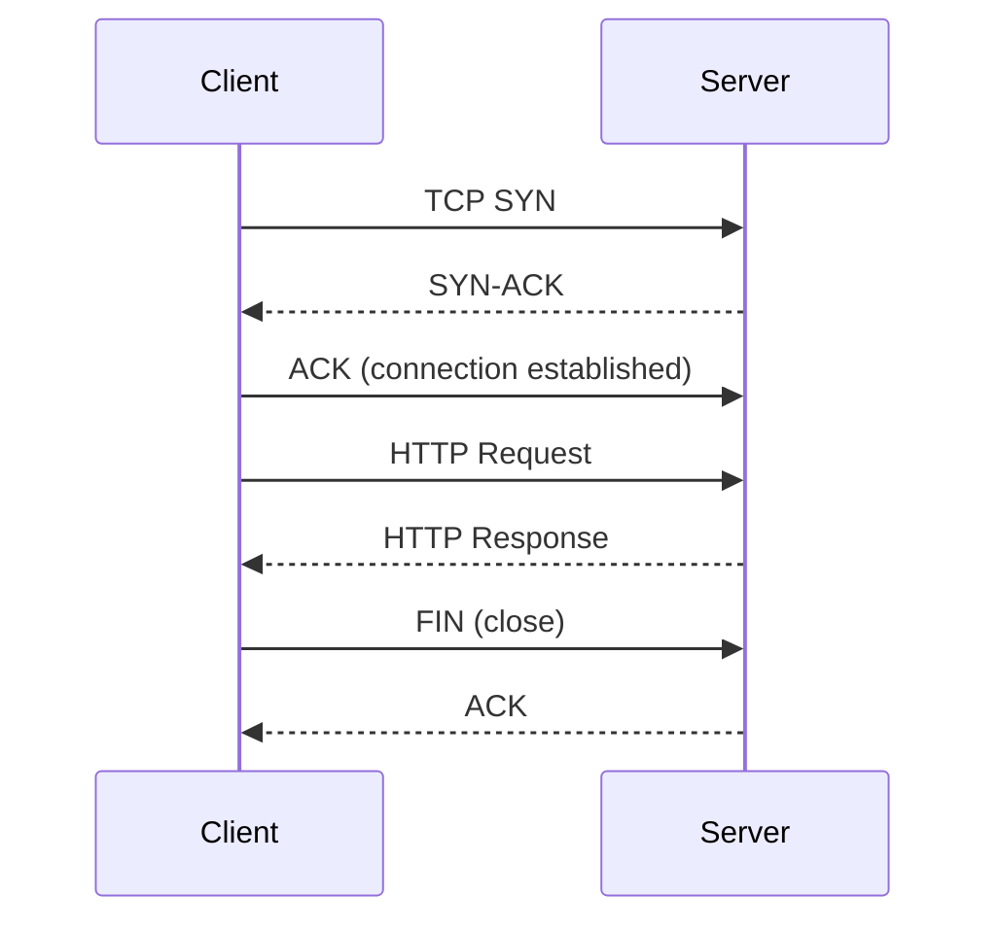

# Network Protocols (TCP/IP, UDP, HTTP)

## 0) Metadata
- **Name**: Network Protocols
- **Canonical Path**: Patterns/001_Fundamentals/Basics/Network_Protocols.md
- **Category**: 001 Fundamentals
- **Status**: Stable
- **Last Updated**: YYYY-MM-DD
- **Tags**: tcp, udp, http, tls, ip, osi

---

## 1) TL;DR (Executive Summary)
- **Problem**: We need reliable, interoperable communication between networked systems.
- **Solution (essence)**: Layered protocols: IP for addressing/routing, TCP for reliable streams, UDP for datagrams, HTTP for application semantics.
- **Use when**: Building networked services, choosing transport/application protocols.
- **Avoid when**: N/A (choose the right layer/protocol instead).
- **Key tradeoff**: Reliability/ordering (TCP) vs latency/overhead (UDP).

---

## 2) Problem & Context
- Heterogeneous networks and devices must interoperate across unreliable links.
- Different apps need different guarantees (ordering, loss tolerance, latency).

## 3) Decision Drivers
- Required guarantees: reliability, ordering, congestion control.
- Latency sensitivity, message sizes, packet loss tolerance.
- Middleboxes/firewalls, NAT traversal, TLS requirements.

---

## 4) Intuition & Baseline
- Naive: Raw IP packets; app implements everything → complex and brittle.
- Insight: Layering separates concerns: IP routes, TCP ensures reliability, HTTP defines methods/resources.

---

## 5) The Stack (Optimized Approach)
- **Core Concept**:
  - IP: best-effort delivery, addressing, routing.
  - TCP: connection-oriented, reliable, ordered byte stream with congestion control.
  - UDP: connectionless, unordered datagrams; minimal overhead.
  - HTTP: app-layer request/response over TCP (HTTP/1.1), multiplexed streams (HTTP/2), QUIC (HTTP/3 over UDP).
- **Happy-path**: Client establishes connection, sends request, server responds, connection reused.
- **Degraded**: Packet loss triggers retransmission (TCP) or loss-tolerant logic (UDP); TLS handshake retries.

---

## 6) Architecture
### 6.1 Layering Diagram

### 6.2 Connection Sequence (HTTP/1.1 example)

---

## 7) Interfaces
### 7.1 HTTP Methods & Semantics
- GET (safe, idempotent), HEAD, OPTIONS.
- POST (not idempotent), PUT (idempotent), PATCH, DELETE (idempotent by spec intent).
- Status codes: 2xx success, 3xx redirects, 4xx client errors, 5xx server errors.

### 7.2 TLS
- HTTPS = HTTP over TLS; certificates, ciphers, ALPN for HTTP/2 and HTTP/3.

---

## 8) Properties & Guarantees
- TCP: reliable, ordered, flow/congestion-controlled.
- UDP: no delivery/ordering guarantees; lower latency; app must handle loss.
- HTTP/2: multiplexed streams, header compression (HPACK), server push.
- HTTP/3: QUIC over UDP, improved loss recovery, connection migration.

---

## 9) Tradeoffs
| Aspect | TCP | UDP | Notes |
|---|---|---|---|
| Reliability | Yes | No | Retransmits vs app-level handling |
| Ordering | Yes | No | TCP stream vs message framing |
| Latency | Higher | Lower | Handshakes, congestion control |
| NAT/Firewall | Friendly | Sometimes blocked | QUIC/HTTP3 helps |
| Use cases | Web, APIs, DBs | Streaming, gaming, VoIP, telemetry |

---

## 10) Implementation Guide
- Prefer HTTPS; strong TLS configs (modern ciphers), cert automation.
- Timeouts and keep-alives; sane retry policies (with backoff, idempotency).
- Tune TCP (Nagle, keepalive) and kernel limits for high-QPS services.

---

## 11) Pitfalls & Edge Cases
- Head-of-line blocking (HTTP/2 mitigates per-connection; HTTP/3 removes over UDP).
- Retry storms without idempotency → duplicates.
- MTU/fragmentation; large UDP payload loss.
- Misconfigured TLS (weak ciphers, expired certs).

---

## 12) Observability
- Metrics: connection counts, retransmits, RTT, TLS handshake failures, HTTP codes, request latency.
- Tracing: include scheme, host, method, status.

---

## 13) References
- RFCs: 791 (IP), 793 (TCP), 768 (UDP), 7231 (HTTP/1.1), 7540 (HTTP/2), 9000 (QUIC), 9114 (HTTP/3).
- IETF TLS 1.2/1.3 RFCs, Mozilla TLS guidelines.
