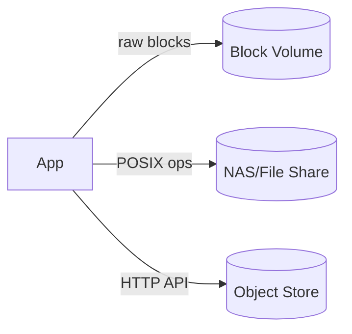

# Storage Types (Block, File, Object)

## 0) Metadata
- **Name**: Storage Types
- **Canonical Path**: Patterns/001_Fundamentals/Basics/Storage_Types.md
- **Category**: 001 Fundamentals
- **Status**: Stable
- **Last Updated**: YYYY-MM-DD
- **Tags**: storage, block, file, object, durability

---

## 1) TL;DR (Executive Summary)
- **Problem**: Different workloads need different storage semantics and performance.
- **Solution (essence)**: Choose among block (raw volumes), file (hierarchical files), and object (flat objects) based on access patterns.
- **Use when**: Mapping application I/O to the right abstraction maximizes performance, simplicity, and cost efficiency.
- **Key tradeoff**: Performance/latency vs scalability/cost and feature set.

---

## 2) Problem & Context
- Databases, VMs, analytics, media all exhibit distinct I/O patterns.
- One-size-fits-all storage leads to overpaying or underperforming systems.

## 3) Decision Drivers
- Access pattern: random vs sequential, block vs whole-file/object.
- Consistency and durability requirements; latency sensitivity.
- Scale: namespace size, throughput, parallelism; cost.

---

## 4) Intuition & Baseline
- Naive: Put everything on shared file storage; becomes bottleneck and hard to scale.
- Insight: Match semantics to workload (DB → block; shared docs → file; media/backups → object).

---

## 5) Options Overview
| Aspect | Block Storage | File Storage | Object Storage |
|---|---|---|---|
| Access Unit | Fixed-size blocks | Files in directories | Objects (key + blob + metadata) |
| Protocols | iSCSI, NVMe-oF | NFS, SMB | HTTP(S) (S3, GCS, Azure Blob) |
| Consistency | Host-controlled (fs/db) | Strong per share | Strong/eventual (service) |
| Latency | Lowest (local/attached) | Low-moderate | Moderate (network, HTTP) |
| Throughput | High | Moderate-High | Very High (parallel) |
| Scaling | Per volume | Per share/cluster | Virtually unlimited |
| Features | Snapshots, replication | ACLs, locks, POSIX-ish | Lifecycle, versioning, tiers, events |
| Cost | Higher per GB | Moderate | Lowest per GB |
| Use Cases | DB volumes, VMs | Shared home dirs, ML datasets | Media, backups, logs, data lakes |

---

## 6) Architecture

---

## 7) Properties & Guarantees
- Block: performance depends on host/filesystem/DB; ideal for low-latency random I/O.
- File: hierarchical namespace, shared access, file locks; good for team/shared datasets.
- Object: flat namespace, per-object consistency, high durability (11x9s typical), lifecycle policies.

---

## 8) Tradeoffs
| Aspect | Pros | Cons | Notes |
|---|---|---|---|
| Block | Lowest latency; DB-friendly | Manage FS/DB; scaling per volume | Use RAID, snapshots |
| File | Shared semantics; POSIX-ish | Scaling limits; lock contention | Scale-out NAS for growth |
| Object | Infinite scale; cheap; features | Higher latency; eventual consistency (some ops) | Great for immutables, large binaries |

---

## 9) Implementation Guide
- Block: choose volume type (SSD/HDD/IOPS), align FS/DB configs; backups via snapshots.
- File: NFS/SMB versions; directory structure, quotas; cache clients appropriately.
- Object: bucket layout, key naming for prefix distribution, lifecycle tiers (hot/warm/cold), signed URLs.

---

## 10) Pitfalls & Edge Cases
- Object "rename" is copy+delete; plan for atomicity.
- Hot prefixes in object stores; distribute keys.
- NFS stale handles, lock contention; version mismatches.
- Block volume saturation; IOPS vs throughput limits.

---

## 11) Observability
- Metrics: IOPS, throughput, latency, error rates, 4xx/5xx for object; cache hit ratio.
- Alerts: sustained latency/IOPS saturation; error spikes.

---

## 12) Security & Compliance
- Encryption at rest and in transit; KMS integration.
- Access controls: IAM (object), POSIX/ACLs (file), host controls (block).
- Data residency, retention, legal hold; WORM where needed.

---

## 13) References
- Vendor docs: AWS EBS/EFS/S3, GCP Persistent Disks/Filestore/Cloud Storage, Azure equivalents.
- DDIA (Kleppmann) chapters on storage models.
