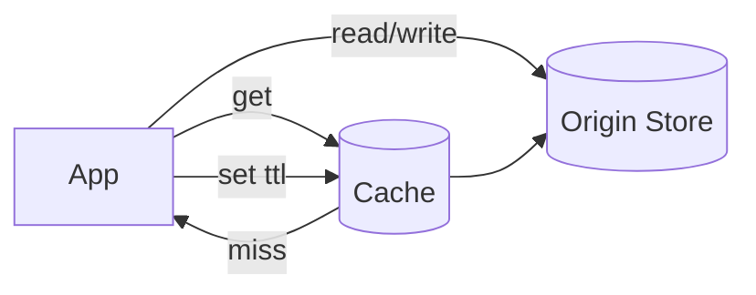

# Caching Strategies

## 0) Metadata
- **Name**: Caching Strategies
- **Canonical Path**: Patterns/001_Fundamentals/ScalabilityConcepts/Caching_Strategies.md
- **Category**: 001 Fundamentals
- **Status**: Stable
- **Last Updated**: YYYY-MM-DD
- **Tags**: cache, ttl, eviction, consistency, stampede

---

## 1) TL;DR (Executive Summary)
- **Problem**: Repeated reads of the same data overwhelm origin stores and increase latency.
- **Solution (essence)**: Store hot data closer to compute/users with defined freshness and eviction.
- **Use when**: Read-heavy workloads; skewed access; origin is slower/costly.
- **Key tradeoff**: Freshness vs speed/cost.

---

## 2) Problem & Context
- Many systems show strong temporal and popularity locality.
- Caching can cut latency by orders of magnitude and reduce origin cost.

## 3) Decision Drivers
- Consistency tolerance (eventual vs strong); acceptable staleness window.
- Data size/shape; serialization cost; mutation rate.
- Hit ratio targets; failure behavior on miss or cache outage.

---

## 4) Strategies
- **Cache-Aside (Lazy Loading)**: App reads cache first, loads on miss, writes to cache.
- **Write-Through**: Writes go to cache and origin synchronously.
- **Write-Back (Write-Behind)**: Write to cache then async to origin.
- **Refresh-Ahead**: Proactively refresh before TTL expiry.
- **CDN/Edge**: HTTP caching with headers (Cache-Control, ETag).

---

## 5) Architecture

---

## 6) Properties & Guarantees
- Cache hit latency microseconds–low ms; miss path is origin-bound.
- Consistency depends on strategy; write-back risks loss on crash.
- Eviction via LRU/LFU/FIFO + TTLs.

---

## 7) Tradeoffs
| Strategy | Pros | Cons | Notes |
|---|---|---|---|
| Cache-Aside | Simple; cache only hot keys | Cold starts; stale data | Add read-through lib |
| Write-Through | Consistent reads | Higher write latency | Good with low write rates |
| Write-Back | Fast writes | Data loss risk; complexity | WAL/journal + durability |
| Refresh-Ahead | Fewer misses | Wasted refreshes | Predict usage windows |

---

## 8) Implementation Guide
- Key design: deterministic keys; version in key for schema changes.
- TTLs: base + jitter to avoid coordinated expiry.
- Prevent stampede: request coalescing, mutex per key, soft TTL + background refresh.
- Handle hot keys: sharding, local caches, replication, admission control.

---

## 9) Pitfalls & Edge Cases
- Invalidation is hard: prefer versioned keys and narrow TTLs over ad-hoc deletes.
- Serialization cost dominates for large objects; compress judiciously.
- Cache outage: decide to fail-open (stale) vs fail-closed.

### Edge-case Checklist
- Partial failures on multi-key operations.
- Backpressure when hit ratio drops.
- Per-tenant quotas to avoid noisy neighbors.

---

## 10) Observability
- Metrics: hit ratio, latency, evictions, memory usage, key distribution.
- Alerts: hit ratio below target; memory pressure; elevated miss latency.

---

## 11) References
- DDIA caching chapters; CDN vendor docs; Redis/Memcached best practices.
