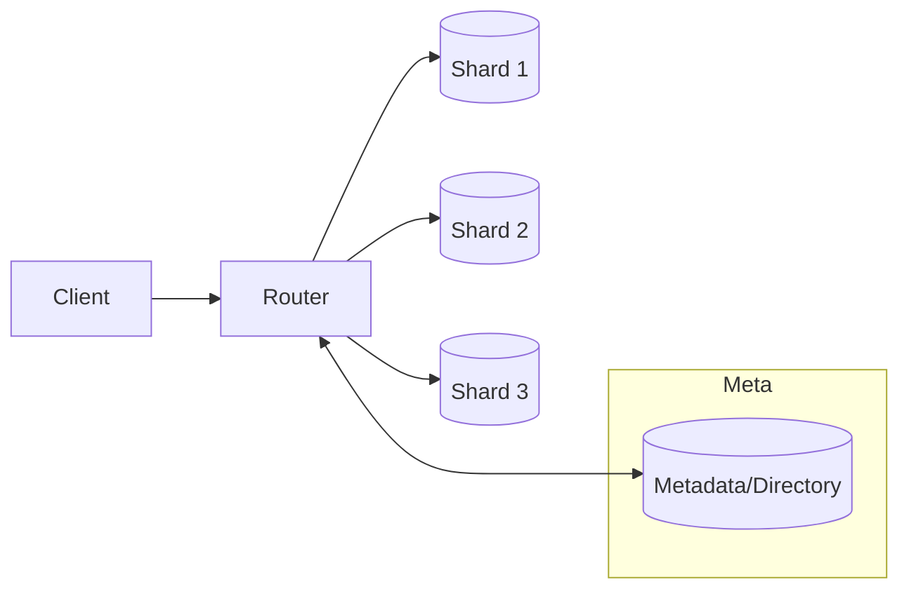

# Database Sharding & Partitioning

## 0) Metadata
- **Name**: Database Sharding & Partitioning
- **Canonical Path**: Patterns/001_Fundamentals/ScalabilityConcepts/Database_Sharding_Partitioning.md
- **Category**: 001 Fundamentals
- **Status**: Stable
- **Last Updated**: YYYY-MM-DD
- **Tags**: sharding, partitioning, routing, resharding, consistency

---

## 1) TL;DR (Executive Summary)
- **Problem**: Single-node databases hit storage/throughput/latency limits.
- **Solution (essence)**: Split data across partitions/shards by a key; route queries to the right shard.
- **Use when**: Dataset or QPS exceeds single-node limits; hot rows/tenants exist.
- **Key tradeoff**: Simpler queries vs scalability and isolation.

---

## 2) Problem & Context
- Vertical scaling has hard ceilings; multi-tenant growth causes hotspots.
- Cross-tenant isolation and noisy neighbor concerns.

## 3) Decision Drivers
- Access patterns and primary keys; ratio of single-shard vs cross-shard operations.
- Consistency needs across entities; transactional boundaries.
- Resharding strategy; operational tooling; online migrations.

---

## 4) Partitioning Strategies
- **Range**: by ordered key (e.g., date, userId ranges); easy scans; hotspot risk.
- **Hash**: distribute uniformly; avoids hotspots; makes range queries harder.
- **List/Directory**: explicit groups (e.g., region/tenant); operational clarity.
- **Composite**: hash-within-range; time-bucketed hash to smooth load and allow TTLs.
- **Consistent Hashing**: for cache/shard rings; easier rebalancing with virtual nodes.

---

## 5) Architecture

---

## 6) Properties & Guarantees
- Scalability: near-linear for single-shard ops when key distribution is uniform.
- Availability: failure domain limited to shard; directory/router must be HA.
- Consistency: per-shard strong; cross-shard needs 2PC/sagas or eventual.
- Latency: routing adds hop; locality-aware routing helps.

---

## 7) Tradeoffs
| Aspect | Pros | Cons | Notes |
|---|---|---|---|
| Range | Efficient scans | Hot ranges | Time-bucketing mitigates |
| Hash | Uniform load | Painful ranges | Secondary indexes per shard |
| Directory | Explicit control | Manual balancing | Useful for tenants/regions |
| Composite | Balanced + scanable | More complexity | Great for time-series |

---

## 8) Implementation Guide
- Pick shard key aligned to top queries; avoid high-skew keys.
- Routing tier: library or service; consistent hashing + virtual nodes.
- Secondary indexes: local per shard; global indexes are complex.
- Cross-shard writes: use sagas or 2PC sparingly; design for compensation.
- Resharding: online via dual-writes/reads; backfill; cutover; verify.

---

## 9) Pitfalls & Edge Cases
- Hot partitions from ascending keys (e.g., auto-increment, timestamp).
- Multi-entity transactions across shards; prefer eventual consistency patterns.
- Ghost traffic during resharding; ensure idempotency and versioned keys.

### Edge-case Checklist
- Backfills throttled with progress checkpoints.
- Read/write splitting during migrations with flags.
- Strong versus eventual read paths documented.

---

## 10) Observability
- Metrics: per-shard QPS/latency/error, key distribution, router hit ratios.
- Alerts: shard imbalance, elevated tail latency, resharding lag.

---

## 11) References
- DDIA chapters on partitioning; Spanner/Cockroach papers; Vitess and Citus docs.
