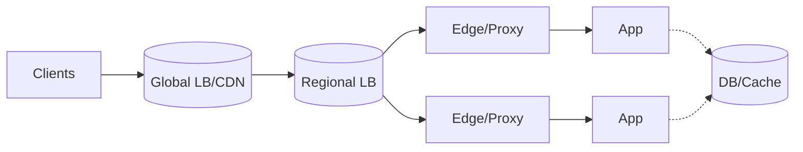

# Load Balancing

## 0) Metadata
- **Name**: Load Balancing
- **Canonical Path**: Patterns/001_Fundamentals/ScalabilityConcepts/Load_Balancing.md
- **Category**: 001 Fundamentals
- **Status**: Stable
- **Last Updated**: YYYY-MM-DD
- **Tags**: l4, l7, reverse-proxy, health-checks, stickiness

---

## 1) TL;DR (Executive Summary)
- **Problem**: Distribute traffic across replicas for scale and availability.
- **Solution (essence)**: A balancer selects a healthy backend per request using a routing algorithm.
- **Use when**: You have multiple instances; need HA; need zero-downtime deploys.
- **Key tradeoff**: Simplicity (round-robin) vs accuracy (least-load), cache affinity, and state.

---

## 2) Problem & Context
- Single instance cannot handle peak/bursty load and is a SPOF.
- Need health checks, outlier detection, and connection management.

## 3) Decision Drivers
- L4 (TCP/UDP) vs L7 (HTTP) features; TLS termination; WAF needs.
- Algorithms: round-robin, least-connections, weighted, IP hash, consistent hashing.
- Session stickiness, caching, multi-region/global LB.

---

## 4) Intuition & Baseline
- Naive: Random client selection; no health checks.
- Insight: Centralized or anycast LB with active health checks and intelligent routing.

---

## 5) Approaches
- **L4**: Transport-level; fast; fewer features.
- **L7**: HTTP-aware; routing by path/headers/cookies, compression, caching.
- **Algorithms**:
  - Round Robin (weighted)
  - Least Connections/Load
  - IP Hash (affinity)
  - Consistent Hashing (cache/shard affinity)

---

## 6) Architecture

---

## 7) Properties & Guarantees
- Improves availability via health checks and failover.
- Evens load; reduces tail latency with smarter algorithms.
- Adds hop/latency; balancer itself must be HA.

---

## 8) Tradeoffs
| Aspect | Pros | Cons | Notes |
|---|---|---|---|
| L4 | Fast, simple | No HTTP routing | Good for TLS passthrough |
| L7 | Rich routing, observability | Heavier, more state | Termination, WAF |
| RR | Simple | Ignores load skew | Weight for heterogenous nodes |
| Least Conn | Tracks load | More overhead | Great for long-lived conns |
| IP/Consistent Hash | Affinity | Uneven distribution | Use virtual nodes |

---

## 9) Implementation Guide
- Health checks: interval, timeout, thresholds.
- Outlier detection and circuit breaking.
- Connection pooling/keep-alives; slow start for new nodes.
- Multi-AZ balancers; avoid single point of failure.

---

## 10) Pitfalls & Edge Cases
- Sticky sessions with stateful apps; externalize session state.
- Uneven load due to long-lived connections; pick least-load.
- Cascading failures if retries amplify; jitter and budgets.

### Edge-case Checklist
- Graceful drain on scale-in/deploys.
- Backoff on backends returning 5xx/timeouts.
- Split traffic per AZ/region to reduce blast radius.

---

## 11) Observability
- Metrics: success rates, p95/p99, active connections per backend, health status.
- Logs: request logs at LB/proxy; include backend, retries.

---

## 12) References
- Envoy, NGINX, HAProxy docs; cloud LB services; SRE Book (load balancing). 
