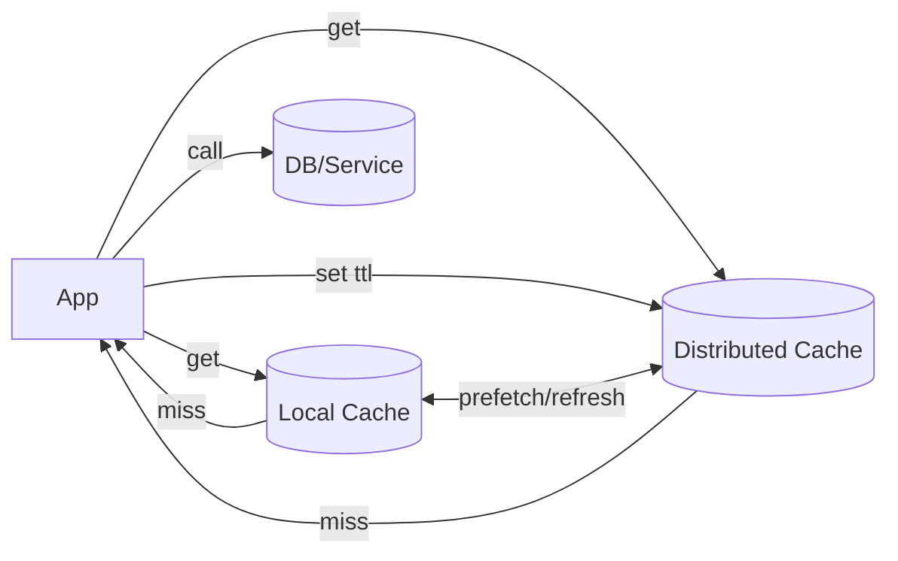

# Application Caching (In-Process & Distributed)

## 0) Metadata
- **Name**: Application Caching
- **Canonical Path**: Patterns/002_CoreComponents/Caching/Application_Caching.md
- **Category**: 002 Core Components
- **Status**: Stable
- **Last Updated**: YYYY-MM-DD
- **Tags**: cache, in-memory, near-cache, ttl, eviction, coherence

---

## 1) TL;DR (Executive Summary)
- **Problem**: Recomputing or refetching frequently used data is slow and costly.
- **Solution (essence)**: Keep hot data in fast storage (process memory or nearby) with clear freshness and eviction policies.
- **Use when**: Read-heavy hotspots; expensive computations; downstream latency.
- **Key tradeoff**: Freshness/consistency vs latency/cost.

---

## 2) Types
- In-process (local): per-instance cache (e.g., Caffeine/Guava, in-memory maps).
- Near-cache: local cache fronting a distributed cache (two-layer).
- Distributed: external cache (Redis/Memcached) shared across instances.

## 3) Decision Drivers
- Required hit ratio and staleness tolerance.
- Instance count and scale (coherence needs across nodes).
- Object sizes, serialization cost, GC pressure.

---

## 4) Intuition & Baseline
- Naive: always call DB/remote service.
- Insight: memoize expensive/slow calls; keep results close; limit staleness.

---

## 5) Architecture

---

## 6) Properties & Guarantees
- Local cache latency ~ microseconds; distributed ~ sub-ms to low ms.
- Coherence: local caches can diverge; refresh or invalidation required.
- Eviction: size-based (LRU/LFU) + TTL; jitter to avoid herd expiry.

---

## 7) Tradeoffs
| Type | Pros | Cons | Notes |
|---|---|---|---|
| Local | Fastest; no network | Stale per instance | Good for pure reads |
| Distributed | Shared; coherent | Network hop; ops | Use for cross-instance sharing |
| Two-layer | High hit ratio | More complexity | Soft TTL + background refresh |

---

## 8) Implementation Guide
- Key design: stable, deterministic keys; include version for schema changes.
- TTL policy: base + jitter; soft TTL (serve stale + async refresh) for tail.
- Prevent stampede: single-flight/dedup per key; mutex; request coalescing.
- Size/GC: cap entries; weigh by size; avoid caching huge blobs locally.

---

## 9) Pitfalls & Edge Cases
- Coherence: local caches stale after writes; use pub/sub invalidation or short TTLs.
- Serialization/compression overhead; benchmark end-to-end.
- Hot keys: shard/admit; pre-warm if needed.

### Edge-case Checklist
- Cache outage behavior (fail open with stale or fail closed?).
- Idempotency for refresh and writes.
- Per-tenant quotas; protect against noisy neighbors.

---

## 10) Observability
- Metrics: hit/miss ratio per tier, latency, evictions, memory usage.
- Alerts: hit ratio below target, memory pressure, elevated miss latency.

---

## 11) References
- Caffeine/Guava docs; Redis/Memcached; DDIA on caching.
