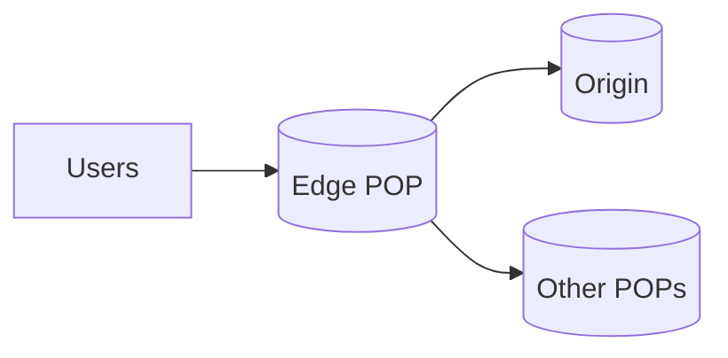

# Content Delivery Network (CDN)

## 0) Metadata
- **Name**: CDN
- **Canonical Path**: Patterns/002_CoreComponents/Caching/CDN.md
- **Category**: 002 Core Components
- **Status**: Stable
- **Last Updated**: YYYY-MM-DD
- **Tags**: cdn, edge, cache-control, purge, s3-origin

---

## 1) TL;DR (Executive Summary)
- **Problem**: Latency and origin load for static/semistatic content served globally.
- **Solution (essence)**: Cache content at edge POPs close to users, honoring cache headers and invalidations.
- **Use when**: Static assets, media, APIs with cacheable responses.
- **Key tradeoff**: Freshness vs performance and egress cost.

---

## 2) Problem & Context
- Global users experience high RTT without edge presence.
- Origins can become bottlenecks on bursty traffic.

## 3) Decision Drivers
- Content mutability; acceptable staleness; personalization.
- Header strategy: Cache-Control, ETag/If-None-Match, Surrogate-Control.
- Purge model: by URL, prefix, tag; time to live vs on-demand.

---

## 4) Architecture

---

## 5) Properties & Guarantees
- Large offload from origin; lower tail latency.
- Consistency via TTLs/ETags; eventual freshness across POPs.
- Edge compute can modify responses, auth, and routing.

---

## 6) Tradeoffs
| Aspect | Pros | Cons | Notes |
|---|---|---|---|
| Performance | Global low latency | Stale risk | Tune TTL and revalidation |
| Cost | Offload origin egress | CDN fees | Compress, bundle |
| Control | Headers + purge | Edge complexity | Test rules |

---

## 7) Implementation Guide
- Set explicit Cache-Control; immutable + long TTL for versioned assets.
- Use versioned URLs (hash in filename) and never purge.
- For APIs: use ETag/Last-Modified, Surrogate-Control, vary headers carefully.
- Purge by tag/prefix for dynamic content.

---

## 8) Pitfalls & Edge Cases
- Over-varying (cookies, headers) kills cacheability.
- Private content leakage; ensure proper auth at edge.
- POP cold starts; pre-warm critical assets.

---

## 9) Observability
- Metrics: hit ratio per POP, RTT, origin offload, egress.
- Alerts: hit ratio drops; elevated misses at specific POPs.

---

## 10) References
- Cloudflare, Akamai, Fastly docs; RFCs for HTTP caching; Surrogate-Control headers.
