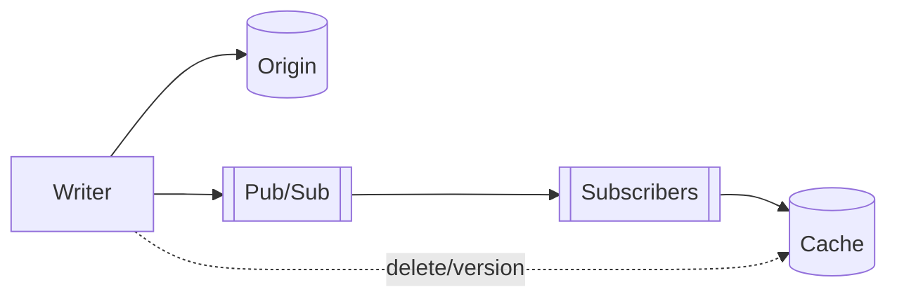

# Cache Invalidation Strategies

## 0) Metadata
- **Name**: Cache Invalidation Strategies
- **Canonical Path**: Patterns/002_CoreComponents/Caching/Cache_Invalidation_Strategies.md
- **Category**: 002 Core Components
- **Status**: Stable
- **Last Updated**: YYYY-MM-DD
- **Tags**: invalidation, ttl, pubsub, versioned-keys, coherence

---

## 1) TL;DR (Executive Summary)
- **Problem**: Stale cache entries cause incorrect results.
- **Solution (essence)**: Define clear expiry and invalidation rules aligned to write paths and data semantics.
- **Use when**: Any caching layer beyond trivial local-only caches.

---

## 2) Techniques
- TTLs: hard expiry; add jitter to avoid herd.
- Soft TTL + background refresh: serve stale briefly, refresh async.
- Explicit invalidation on writes: targeted delete per key/pattern.
- Versioned keys: embed version/hash so new writes create new keys.
- Pub/Sub invalidation: writers publish invalidation events to subscribers.
- Tag-based invalidation: group keys under tags then purge by tag (if supported).

---

## 3) Architecture

---

## 4) Properties & Tradeoffs
| Method | Pros | Cons | Notes |
|---|---|---|---|
| TTL | Simple | Stale until expiry | Add jitter |
| Soft TTL | Better tail | May serve stale briefly | Good UX |
| Explicit Delete | Precise | Complex key mgmt | Tooling required |
| Versioned Keys | No delete needed | More keys alive | Good for CDNs |
| Pub/Sub | Timely | Infra dependency | Use for multi-node coherence |
| Tags | Bulk ops | Requires support | Useful for groups |

---

## 5) Implementation Guide
- Map write paths to affected cache keys/tags.
- Prefer versioned keys when invalidation scope is large or unknown.
- Fall back to TTLs if precise invalidation is too costly.

---

## 6) Pitfalls & Edge Cases
- Wildcard deletes are slow/dangerous; avoid KEYS scans.
- Races: write completes but invalidation delayed; use ordering or transactional outbox.
- Multi-region: propagate invalidations; consider shorter TTLs at edge.

---

## 7) Observability
- Metrics: invalidations per sec, latency, stale read rate, key age distribution.
- Alerts: invalidation failures/backlogs.

---

## 8) References
- CDN invalidation docs; Redis keyspace notifications; outbox/inbox patterns.
