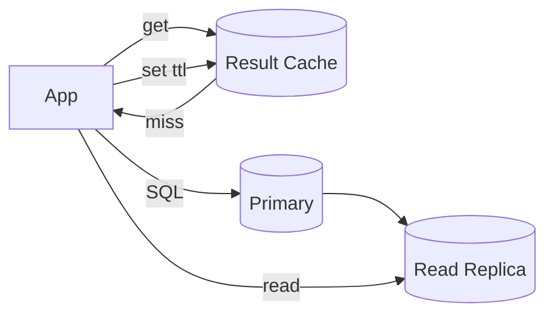

# Database Caching (Query & Result Caching)

## 0) Metadata
- **Name**: Database Caching
- **Canonical Path**: Patterns/002_CoreComponents/Caching/Database_Caching.md
- **Category**: 002 Core Components
- **Status**: Stable
- **Last Updated**: YYYY-MM-DD
- **Tags**: db-cache, query-cache, result-cache, invalidation, replicas

---

## 1) TL;DR (Executive Summary)
- **Problem**: DB read latency and load are high for repeated queries.
- **Solution (essence)**: Cache query results/rows close to the app and invalidate efficiently on writes.
- **Use when**: Read-heavy endpoints; repeated query patterns; expensive aggregations.
- **Key tradeoff**: Freshness vs read performance/cost.

---

## 2) Approaches
- App-level result cache (Redis/Memcached) with keys = query + params + version.
- ORM second-level cache for entities/associations.
- Materialized views/summary tables (periodic or event-driven refresh).
- Read replicas for scale-out reads (eventually consistent).

## 3) Decision Drivers
- Write frequency; staleness tolerance; acceptable lag for replicas.
- Query diversity; cache key design feasibility.

---

## 4) Architecture

---

## 5) Properties & Guarantees
- High hit ratio reduces DB CPU/IO; tail latency improves.
- Replica reads are stale by replication lag; not read-your-writes.
- Cache invalidation must be aligned to write paths.

---

## 6) Tradeoffs
| Option | Pros | Cons | Notes |
|---|---|---|---|
| Result Cache | Biggest wins for hotspots | Invalidation complexity | Versioned keys |
| ORM Cache | Transparent | Coherence across instances | Use with caution |
| Materialized View | Fast complex queries | Stale until refresh | Event-driven refresh |
| Read Replicas | Offload reads | Stale reads | For non-critical reads |

---

## 7) Implementation Guide
- Keying: normalize SQL + params; include schema/hash version to avoid stale.
- Invalidation: on writes to affected tables/rows; pub/sub or version bump.
- TTLs: short for volatile data; longer for immutable/slow-changing.

---

## 8) Pitfalls & Edge Cases
- Thundering herd on cache miss; coalesce.
- SELECT N+1; cache doesn’t fix bad query shapes.
- Replica lag surprises; pin read-your-writes to primary.

### Edge-case Checklist
- Bulk updates/ETL invalidate or version-bump.
- Pagination caching with cursors not offsets.
- Multi-tenant cache key scoping.

---

## 9) Observability
- Metrics: hit ratio per query family, DB CPU/IO, replica lag, cache latency.
- Alerts: hit ratio drop, replica lag thresholds, cache timeouts.

---

## 10) References
- Postgres/MySQL docs on replicas/materialized views; Redis patterns; DDIA caching chapters.
