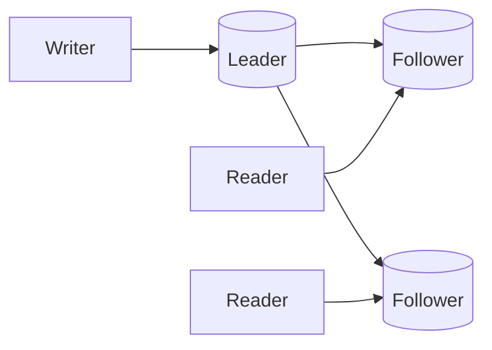

# Data Replication & Consistency

## 0) Metadata
- **Name**: Data Replication & Consistency
- **Canonical Path**: Patterns/002_CoreComponents/Databases/Data_Replication_Consistency.md
- **Category**: 002 Core Components
- **Status**: Stable
- **Last Updated**: YYYY-MM-DD
- **Tags**: replication, leader-follower, quorum, eventual, consistency-models

---

## 1) TL;DR (Executive Summary)
- **Problem**: Single copy of data can’t meet availability/latency; need redundancy.
- **Solution (essence)**: Replicate data across nodes/regions with defined write/read quorums and consistency semantics.
- **Use when**: HA, low-latency reads, disaster recovery.
- **Key tradeoff**: Consistency vs availability/latency (CAP, PACELC).

---

## 2) Replication Models
- Leader-Follower: single writer, async/ semi-sync followers.
- Multi-Leader: multiple writers; conflict resolution required.
- Leaderless/Quorum: read/write quorums (N,R,W); eventual with tunable consistency.

## 3) Consistency Models
- Strong, Linearizable; Sequential; Causal; Eventual.
- Read-your-writes, Monotonic reads, Monotonic writes, Writes follow reads.

---

## 4) Architecture

---

## 5) Properties & Guarantees
- Sync replication: lower RPO, higher write latency.
- Async replication: higher availability, risk of data loss on failover.
- Quorums: choose R and W such that R+W> N for no stale reads.

---

## 6) Tradeoffs
| Aspect | Leader-Follower | Multi-Leader | Leaderless |
|---|---|---|---|
| Writes | simple | conflict-prone | quorum |
| Reads | easy to scale | local writes per region | quorum/tunable |
| Failover | simple | complex | none (hinted handoff) |

---

## 7) Implementation Guide
- Choose replication factor per durability target.
- Define failover plan: detection, promotion, fencing, DNS updates.
- Versioning/conflict resolution: LWW, vector clocks, CRDTs.
- Read-repair, anti-entropy, hinted handoff for leaderless.

---

## 8) Pitfalls & Edge Cases
- Split-brain and dual primaries; require fencing (STONITH).
- Replica lag and read-your-writes anomalies.
- Clock skew; rely on logical clocks when possible.

### Edge-case Checklist
- DR drills; RPO/RTO tested.
- Safe write semantics during failover.
- Back-pressure when replicas fall behind.

---

## 9) Observability
- Metrics: replication lag, RPO/RTO, quorum failures, conflict counts.
- Alerts: sustained lag, repeated failovers, read anomalies.

---

## 10) References
- CAP/PACELC papers; Dynamo, Raft, Paxos literature; vendor replication guides.
