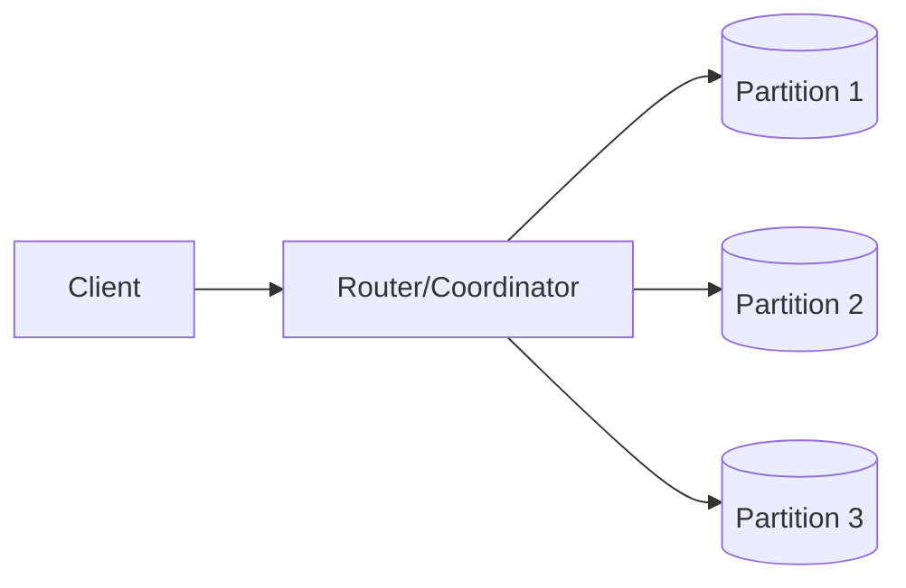

# NoSQL Databases (Key-Value, Document, Column, Graph)

## 0) Metadata
- **Name**: NoSQL Databases
- **Canonical Path**: Patterns/002_CoreComponents/Databases/NoSQL_Databases.md
- **Category**: 002 Core Components
- **Status**: Stable
- **Last Updated**: YYYY-MM-DD
- **Tags**: nosql, key-value, document, column, graph, eventual-consistency

---

## 1) TL;DR (Executive Summary)
- **Problem**: RDBMS constraints/joins hinder scale or fit for some models.
- **Solution (essence)**: Purpose-built stores optimized for specific access patterns and scale.
- **Use when**: Flexible schema, massive scale, simple queries, denormalized models.
- **Key tradeoff**: Flexibility and scalability vs transactional joins and strict consistency.

---

## 2) Families & Use Cases
- Key-Value: session stores, caching, feature flags.
- Document: user profiles, catalogs (JSON documents with secondary indexes).
- Column (wide-column): time-series, analytics (sparse, large tables).
- Graph: relationships, recommendations, fraud detection.

## 3) Decision Drivers
- Query patterns (point lookups vs range scans vs traversals).
- Consistency model (tunable consistency, eventual vs strong options).
- Partitioning and replication support; multi-region needs.

---

## 4) Intuition & Baseline
- Denormalize to reduce joins; design schema from queries backward.
- Partition keys determine scalability and skew resilience.

---

## 5) Architecture

---

## 6) Properties & Guarantees
- Scale-out by partitioning; replication for HA.
- Tunable consistency (quorum reads/writes) in many systems.
- Limited cross-partition transactions (usually).

---

## 7) Tradeoffs
| Aspect | Key-Value | Document | Column | Graph |
|---|---|---|---|---|
| Model | simple | hierarchical | wide sparse | nodes/edges |
| Queries | key lookup | fields, secondary idx | range/aggregations | traversals |
| Scale | excellent | great | excellent | variable |
| Consistency | varies | varies | tunable | varies |

---

## 8) Implementation Guide
- Choose partition key to balance load; avoid hot partitions.
- Precompute aggregations/materialized views for common reads.
- Use write batches; handle idempotency and upserts.

---

## 9) Pitfalls & Edge Cases
- Unbounded document growth; split or archive.
- Secondary index write amplification; plan capacity.
- Cross-partition queries exploding; redesign keys or add search layer.

### Edge-case Checklist
- Backfill/index build strategies.
- Multi-region conflict resolution.
- TTL policies and compaction impact.

---

## 10) Observability
- Metrics: p95/p99, partition hotspots, replication lag, compactions.
- Alerts: timeouts, high tail latency, coordinator saturation.

---

## 11) References
- Dynamo, Bigtable, Cassandra, MongoDB, Neo4j papers and docs; DDIA NoSQL chapters.
