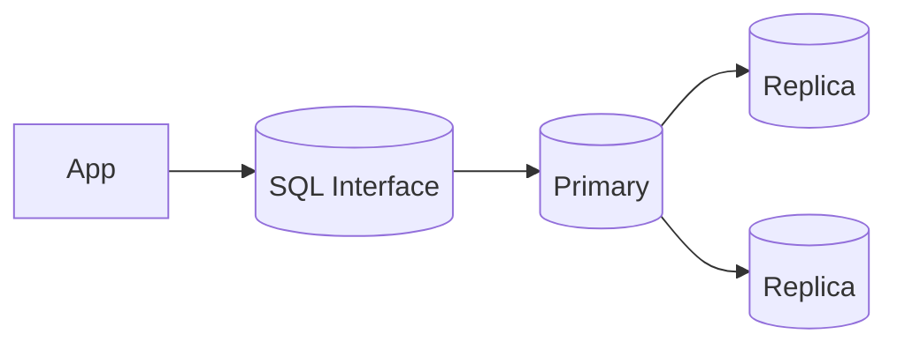

# Relational Databases (RDBMS)

## 0) Metadata
- **Name**: Relational Databases
- **Canonical Path**: Patterns/002_CoreComponents/Databases/Relational_Databases.md
- **Category**: 002 Core Components
- **Status**: Stable
- **Last Updated**: YYYY-MM-DD
- **Tags**: rdbms, sql, transactions, indexes, normalization

---

## 1) TL;DR (Executive Summary)
- **Problem**: Need reliable, consistent storage with rich querying and transactions.
- **Solution (essence)**: Tabular schema with SQL, ACID transactions, indexes, and constraints.
- **Use when**: Strong consistency, complex joins, integrity constraints; OLTP workloads.
- **Key tradeoff**: Rigor and consistency vs horizontal scalability and flexibility.

---

## 2) Problem & Context
- Applications need correctness (money, orders), constraints (FK/unique), and concurrent access.
- Queries benefit from declarative SQL and cost-based optimization.

## 3) Decision Drivers
- Transactional guarantees, write/read volume, join complexity, data model stability.
- Operational model: single primary with replicas vs distributed SQL.

---

## 4) Intuition & Baseline
- Naive KV storage makes multi-row invariants and joins hard.
- RDBMS enforces structure and constraints, enabling safe concurrency.

---

## 5) Core Concepts
- Schema (tables, columns, types), keys (PK/FK), constraints (unique/check), indexes (B-Tree/Hash/GiST).
- Transactions: BEGIN/COMMIT/ROLLBACK; isolation levels (RC, RR, SI, S). Locking and MVCC.
- Query optimizer, execution plans; statistics-driven.

---

## 6) Architecture

---

## 7) Properties & Guarantees
- ACID; referential integrity.
- Read replicas for scale; eventual consistency on replicas (async).
- Backups, PITR, WAL/redo logs.

---

## 8) Tradeoffs
| Aspect | Pros | Cons | Notes |
|---|---|---|---|
| Consistency | Strong, transactional | Cross-region latency | Tune isolation |
| Performance | Optimized queries | Write bottleneck at primary | Partition or CQRS |
| Flexibility | Rich schema/constraints | Migrations needed | Use forward-compatible migrations |
| Scale | Vertical + replicas | Sharding complexity | Consider distributed SQL |

---

## 9) Implementation Guide
- Schema design: normalize to 3NF, denormalize selectively for reads.
- Indexing: cover frequent predicates; avoid over-indexing writes.
- Pooling: connection pools; prepared statements.
- Backups: automated, encrypted; test restores.

---

## 10) Pitfalls & Edge Cases
- N+1 queries; use joins/batching.
- Phantom reads/serializable anomalies; choose isolation level.
- Long transactions → bloat; keep transactions short.

### Edge-case Checklist
- Migration safety (expand-and-contract).
- Replica lag handling; read-your-writes needs primary or session stickiness.
- Hot rows; sequence contention; use batching.

---

## 11) Observability
- Metrics: QPS, latency, lock waits, deadlocks, buffer/cache hit ratio, replication lag.
- Alerts: high lag, deadlock spikes, slow queries beyond SLO.

---

## 12) References
- PostgreSQL, MySQL docs; Designing Data-Intensive Applications; Use The Index, Luke!
