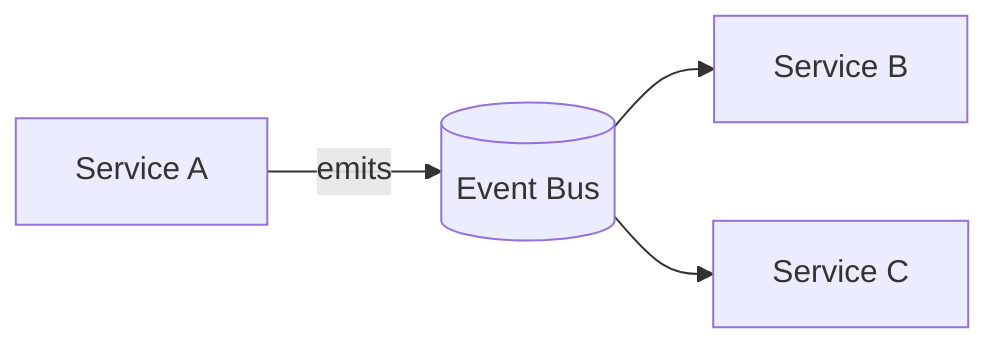

# Event-Driven Architecture (EDA)

## 0) Metadata
- **Name**: Event-Driven Architecture
- **Canonical Path**: Patterns/002_CoreComponents/MessageQueues/Event_Driven_Architecture.md
- **Category**: 002 Core Components
- **Status**: Stable
- **Last Updated**: YYYY-MM-DD
- **Tags**: eda, pubsub, decoupling, eventual-consistency, outbox, saga

---

## 1) TL;DR (Executive Summary)
- **Problem**: Tight coupling between services causes fragility and scaling issues.
- **Solution (essence)**: Services publish domain events; other services react asynchronously.
- **Use when**: Decoupling, fan-out, auditability, cross-service workflows.
- **Key tradeoff**: Eventual consistency and complexity in exchange for decoupling.

---

## 2) Concepts
- Event vs command; event sourcing vs event-driven (not the same).
- Topics/buses; producers/consumers; durable subscriptions.
- Choreography (events) vs orchestration (saga orchestrator).

## 3) Architecture

---

## 4) Properties & Guarantees
- Loose coupling; independent deployability.
- Eventual consistency; ordering depends on transport.
- Replay and audit if events are retained (log).

---

## 5) Tradeoffs
| Aspect | Pros | Cons | Notes |
|---|---|---|---|
| Decoupling | High | Debugging complexity | Correlate with IDs |
| Consistency | Scalable | Eventual | Design for idempotency |
| Performance | Async | Latency for consumers | Use sync path where needed |

---

## 6) Implementation Guide
- Define stable event schemas; versioning policy.
- Outbox pattern to publish after DB commit; inbox dedupe.
- Idempotent consumers; retries with DLQs.
- Correlation/causation IDs for tracing flows.

---

## 7) Pitfalls & Edge Cases
- Lost/duplicate events; exactly-once is rare—design idempotent handlers.
- Fan-out explosions; apply filtering and routing.
- Schema drift; enforce compatibility in CI.

---

## 8) Observability
- Metrics: event publish/consume rates, DLQ size, processing latency.
- Tracing: span links using correlation IDs.

---

## 9) References
- DDIA on dataflow and streams; outbox/inbox and saga patterns; Kafka/RabbitMQ docs.
