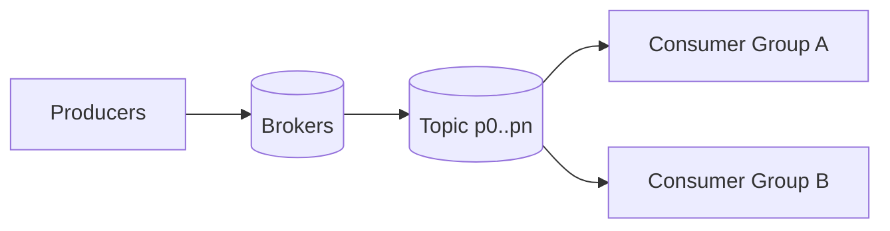

# Apache Kafka (Distributed Log)

## 0) Metadata
- **Name**: Kafka
- **Canonical Path**: Patterns/002_CoreComponents/MessageQueues/Kafka.md
- **Category**: 002 Core Components
- **Status**: Stable
- **Last Updated**: YYYY-MM-DD
- **Tags**: kafka, partitions, consumer-groups, eos, retention

---

## 1) TL;DR (Executive Summary)
- **Problem**: Need durable, scalable, ordered event ingestion and fan-out.
- **Solution (essence)**: Partitioned append-only log with replicated brokers and consumer groups.
- **Use when**: High-throughput event pipelines, stream processing, decoupled services.
- **Key tradeoff**: Ordering limited to partitions; exactly-once requires care.

---

## 2) Core Concepts
- Topics → partitions; producers append; consumers read offsets.
- Consumer groups for parallelism and failover (one consumer per partition).
- Retention by time/size; compaction keeps latest record per key.

## 3) Architecture

---

## 4) Properties & Guarantees
- Ordering within a partition; not across partitions.
- Delivery: at-least-once by default; idempotent producer + transactions for EOS.
- Durability via replication factor; ISR, min.insync.replicas.

---

## 5) Tradeoffs
| Aspect | Pros | Cons | Notes |
|---|---|---|---|
| Throughput | Very high | Batching delays | Tune linger/batch |
| Ordering | Per partition | Cross-partition none | Partition by key |
| Consistency | EOS possible | Complexity | Transactions costly |
| Latency | Low to ms | Tail under load | Backpressure |

---

## 6) Implementation Guide
- Partitioning: choose key to balance load and preserve ordering.
- Producer: enable idempotence; acks=all; retries with backoff.
- Consumer: commit offsets after processing; set reasonable max.poll settings.
- Schema: use Schema Registry and compatibility rules.

---

## 7) Pitfalls & Edge Cases
- Hot partitions; rebalance storms; large messages (>1MB) need special handling.
- Exactly-once across systems is hard; use end-to-end transaction or idempotent sinks.

### Edge-case Checklist
- Backpressure handling, dead-letter topics, retry topics.
- Consumer lag monitoring and alerts.

---

## 8) Observability
- Metrics: producer/consumer latency, throughput, broker disk usage, ISR size, lag.
- Alerts: under-replicated partitions, offline brokers, high lag.

---

## 9) References
- Kafka Definitive Guide; Confluent docs; EOS patterns; Schema Registry.
