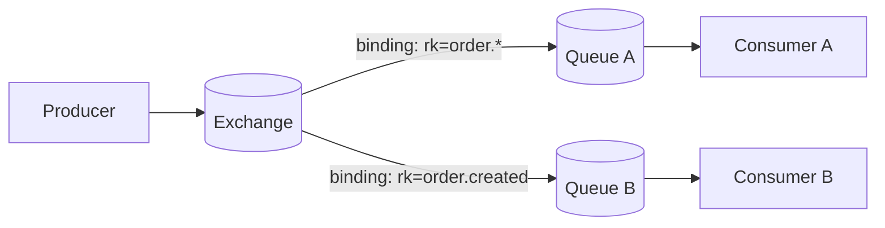

# RabbitMQ (AMQP Broker)

## 0) Metadata
- **Name**: RabbitMQ
- **Canonical Path**: Patterns/002_CoreComponents/MessageQueues/RabbitMQ.md
- **Category**: 002 Core Components
- **Status**: Stable
- **Last Updated**: YYYY-MM-DD
- **Tags**: amqp, exchanges, queues, routing, ack, prefetch

---

## 1) TL;DR (Executive Summary)
- **Problem**: Reliable message delivery with flexible routing patterns.
- **Solution (essence)**: Producers publish to exchanges; bindings route to queues; consumers ack messages.
- **Use when**: Command-style messaging, task queues, RPC, pub/sub with routing.
- **Key tradeoff**: Flexibility of routing vs throughput compared to log systems.

---

## 2) Core Concepts
- Exchange types: direct, topic, fanout, headers.
- Queues bound to exchanges via routing keys/bindings.
- Acknowledgements, redelivery, dead-letter exchanges (DLX).
- Prefetch/QoS to control consumer parallelism.

## 3) Architecture

---

## 4) Properties & Guarantees
- At-least-once delivery with acks; exactly-once via idempotent consumers.
- Ordering within a queue; multiple consumers can reorder unless single-consumer.
- Persistence for durable queues/messages; mirrored queues for HA.

---

## 5) Tradeoffs
| Aspect | Pros | Cons | Notes |
|---|---|---|---|
| Routing | Very flexible | Complexity | Good for command patterns |
| Throughput | Good | Lower than Kafka for logs | Use appropriately |
| Latency | Low | Broker becomes bottleneck | Scale with clustering |

---

## 6) Implementation Guide
- Durable exchanges/queues; persistent messages when needed.
- Idempotent consumers; dedupe keys; handle redeliveries.
- Prefetch tuning to balance fairness vs throughput.
- Dead-letter exchanges with TTLs for retries.

---

## 7) Pitfalls & Edge Cases
- Poison messages causing infinite redelivery; use DLX and max retries.
- Unbounded queues; enforce TTL/length limits.
- Cluster partitions; test network splits.

---

## 8) Observability
- Metrics: queue depth, publish/ack rates, redeliveries, connection counts.
- Alerts: growing queue depth, consumer down, cluster alarms.

---

## 9) References
- RabbitMQ docs; AMQP 0-9-1; patterns for routing and retries.
