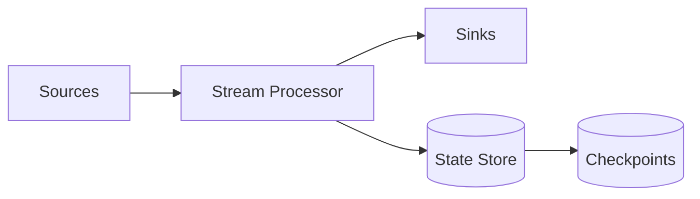

# Stream Processing

## 0) Metadata
- **Name**: Stream Processing
- **Canonical Path**: Patterns/002_CoreComponents/MessageQueues/Stream_Processing.md
- **Category**: 002 Core Components
- **Status**: Stable
- **Last Updated**: YYYY-MM-DD
- **Tags**: streaming, windowing, state, watermarks, exactly-once

---

## 1) TL;DR (Executive Summary)
- **Problem**: Need low-latency, continuous processing of event streams.
- **Solution (essence)**: Stateful operators run over unbounded data with time semantics and checkpoints.
- **Use when**: Real-time analytics, monitoring, fraud detection, enrichment, ETL.
- **Key tradeoff**: Low latency vs correctness under disorder/failures.

---

## 2) Concepts
- Event time vs processing time; watermarks; lateness.
- Windows: tumbling, hopping, sliding, session.
- Stateful operators: joins, aggregations, KTables.
- Checkpointing and recovery; exactly-once processing semantics.

## 3) Architecture

---

## 4) Properties & Guarantees
- At-least-once by default; EOS via transactional sinks + idempotent sources.
- Backpressure handling; autoscaling with partitions.

---

## 5) Tradeoffs
| Aspect | Pros | Cons | Notes |
|---|---|---|---|
| Latency | sub-second | Complexity | Window tuning |
| Accuracy | EOS possible | Overhead | Idempotent sinks |
| Scale | Partition-parallel | Skew risk | Good keys |

---

## 6) Implementation Guide
- Choose framework: Kafka Streams, Flink, Spark Structured Streaming.
- Define keys and partitioning; minimize cross-partition joins.
- Configure checkpoints, state backend (RocksDB), and exactly-once where needed.
- Handle late data with allowed lateness and retractions.

---

## 7) Pitfalls & Edge Cases
- Hot partitions; skewed keys.
- Large state stores; compaction and disk IO.
- Reprocessing correctness; idempotent outputs.

---

## 8) Observability
- Metrics: processing lag, watermark delay, throughput, checkpoint duration, state size.
- Alerts: growing lag, repeated checkpoint failures, OOM in state backend.

---

## 9) References
- The Dataflow Model; Flink/Kafka Streams/Spark docs; DDIA streaming chapters.
