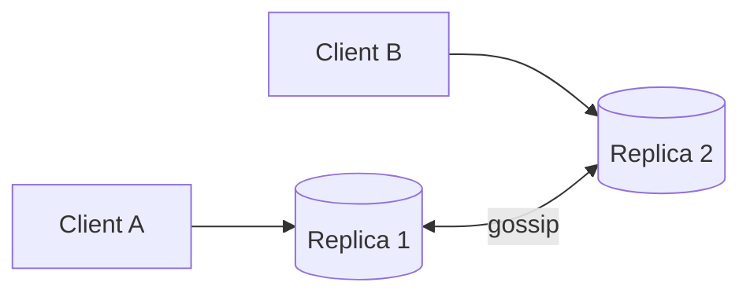

# Eventual Consistency

## 0) Metadata
- **Name**: Eventual Consistency
- **Canonical Path**: Patterns/003_DistributedSystems/ConsistencyModels/Eventual_Consistency.md
- **Category**: 003 Distributed Systems
- **Status**: Stable
- **Last Updated**: YYYY-MM-DD
- **Tags**: eventual, convergence, session-guarantees, crdt

---

## 1) TL;DR (Executive Summary)
- **Definition**: In the absence of further updates, all replicas eventually converge to the same value.
- **Use when**: High availability, geo-distribution, low-latency local reads; systems tolerant of stale reads.

---

## 2) Strengthening Guarantees
- Session guarantees: read-your-writes, monotonic reads, writes-follow-reads.
- Causal consistency: preserves causality without global total order.

---

## 3) Achieving Convergence
- Background anti-entropy, read-repair.
- Conflict resolution: LWW, vector clocks, CRDTs to merge concurrently.

---

## 4) Architecture

---

## 5) Tradeoffs
- Staleness and anomalies possible; clients need idempotency and retries.
- Simpler write paths; better availability/latency under partitions.

---

## 6) Implementation Notes
- Expose endpoints with consistency hints/tokens.
- Choose merge policies per entity; prefer CRDTs for commutative operations.

---

## 7) References
- Amazon Dynamo; Causal consistency papers; CRDT literature; DDIA.
