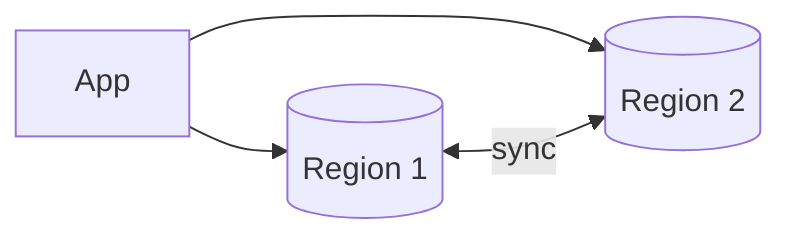

# PACELC Theorem

## 0) Metadata
- **Name**: PACELC Theorem
- **Canonical Path**: Patterns/003_DistributedSystems/ConsistencyModels/PACELC_Theorem.md
- **Category**: 003 Distributed Systems
- **Status**: Stable
- **Last Updated**: YYYY-MM-DD
- **Tags**: pacelc, partition, consistency, latency, cap-extension

---

## 1) TL;DR (Executive Summary)
- **Claim**: Even when there is no Partition (P), systems still tradeoff between Latency (L) and Consistency (C); under partition (PA), trade Availability (A) vs Consistency (C).

---

## 2) Formulation
- If Partition (PA): choose A or C.
- Else (EL): choose L or C.
- Captures normal-operation tradeoffs ignored by CAP.

---

## 3) Intuition
- Synchronous cross-region replication improves consistency but increases tail latency.
- Asynchronous replication reduces latency but risks stale reads.

---

## 4) Architecture Illustration

---

## 5) Properties & Examples
| Choice | Behavior | Example |
|---|---|---|
| PA/CP | Consistency during partitions | Spanner (sync, TrueTime) |
| PA/AP | Availability during partitions | Dynamo-style |
| EL/PC | Low latency, weaker C | Async multi-region replicas |
| EL/EC | Stronger C, higher L | Sync writes across regions |

---

## 6) Implementation Notes
- Make replication strategy explicit per API: strong vs eventual endpoints.
- Offer read-local with read-after-write tokens when feasible.

---

## 7) References
- Daniel Abadi’s PACELC post/paper; system design literature extending CAP.
