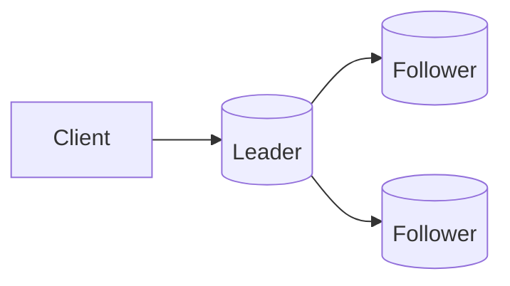

# Strong Consistency

## 0) Metadata
- **Name**: Strong Consistency
- **Canonical Path**: Patterns/003_DistributedSystems/ConsistencyModels/Strong_Consistency.md
- **Category**: 003 Distributed Systems
- **Status**: Stable
- **Last Updated**: YYYY-MM-DD
- **Tags**: linearizability, serializability, quorum, read-your-writes

---

## 1) TL;DR (Executive Summary)
- **Definition**: Operations appear to occur atomically in a single total order (linearizability) or transactions behave as if executed serially (serializability).
- **Use when**: Financial transfers, inventory, configurations where anomalies are unacceptable.

---

## 2) Client Guarantees
- Read-your-writes, monotonic reads, monotonic writes, writes-follow-reads (under linearizable systems).

## 3) Achieving Strong Consistency
- Single-leader with synchronous replication/quorums (R+W>N).
- Consensus protocols (Raft/Paxos) for log replication.
- TrueTime-like bounds (Spanner) for external consistency.

---

## 4) Architecture

---

## 5) Tradeoffs
- Higher write latency (coordination), availability impact during partitions.
- Costly cross-region; may pin writes to a region.

---

## 6) Implementation Notes
- Expose strong-reads endpoints when needed; others can be eventual for latency.
- Use quorum reads for linearizable reads; or lease reads when safe.

---

## 7) References
- Linearizability papers; Spanner; Raft; Jepsen analyses.
