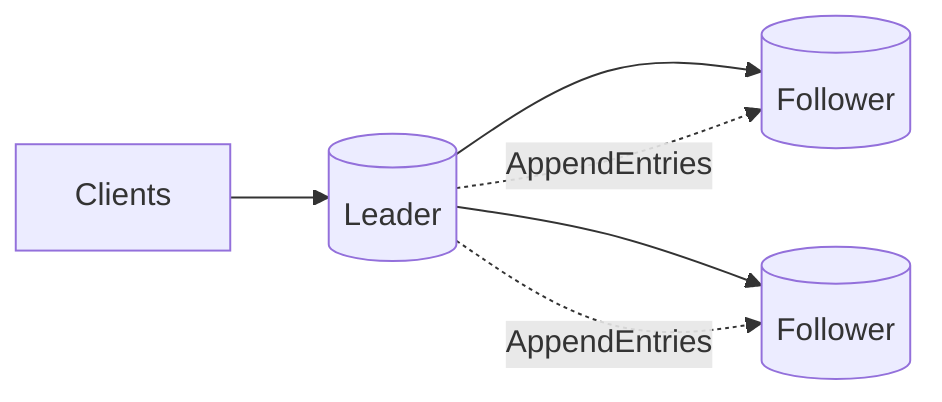

# Consensus Algorithms (Raft, Paxos)

## 0) Metadata
- **Name**: Consensus Algorithms
- **Canonical Path**: Patterns/003_DistributedSystems/DistributedCoordination/Consensus_Algorithms.md
- **Category**: 003 Distributed Systems
- **Status**: Stable
- **Last Updated**: YYYY-MM-DD
- **Tags**: raft, paxos, consensus, leader, log-replication

---

## 1) TL;DR (Executive Summary)
- **Problem**: Replicas must agree on an ordered sequence of operations despite failures.
- **Solution (essence)**: Leader-based log replication with quorum acknowledgment ensures a single agreed-upon history.

---

## 2) Core Ideas
- Leader election; terms/epochs; majority quorums.
- Append-only log; commit when replicated on majority.
- Safety: only committed entries are applied in order.

## 3) Architecture

---

## 4) Properties & Guarantees
- Linearizable state machine replication (with proper client semantics).
- Tolerates f failures with 2f+1 nodes.

---

## 5) Tradeoffs
- Latency added by quorum acks.
- Throughput limited by leader; leader becomes bottleneck.

---

## 6) Implementation Notes
- Use Raft for understandability; Paxos variants common in production.
- Snapshotting and log compaction for long-running systems.
- Clients must retry with leader redirects; idempotency is key.

---

## 7) References
- Raft paper (In Search of an Understandable Consensus Algorithm); Paxos Made Simple; Multi-Paxos.
