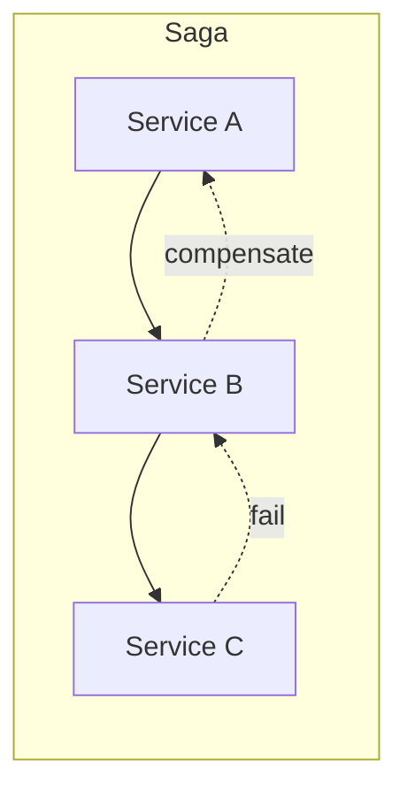

# Distributed Transactions (2PC, Sagas)

## 0) Metadata
- **Name**: Distributed Transactions
- **Canonical Path**: Patterns/003_DistributedSystems/DistributedCoordination/Distributed_Transactions.md
- **Category**: 003 Distributed Systems
- **Status**: Stable
- **Last Updated**: YYYY-MM-DD
- **Tags**: 2pc, saga, outbox, compensation, idempotency

---

## 1) TL;DR (Executive Summary)
- **Problem**: Ensure atomicity across multiple services/datastores.
- **Solutions**:
  - 2PC: coordinator prepares and commits all participants (blocking on failure).
  - Sagas: sequence of local transactions with compensating actions on failure.

---

## 2) Approaches
- 2PC/3PC: strong atomicity; coordinator is SPOF; blocking/locks.
- Sagas (choreography/orchestration): eventual consistency; compensations.
- Outbox/inbox patterns for reliable event publication and dedupe.

## 3) Architecture

---

## 4) Properties & Tradeoffs
| Method | Pros | Cons | Notes |
|---|---|---|---|
| 2PC | Atomic | Blocking; coordinator SPOF | Use within a DB/cluster |
| Sagas | Non-blocking; scalable | Compensation complexity | Prefer for microservices |

---

## 5) Implementation Notes
- Idempotency keys for all steps; retries safe.
- Define compensations upfront; handle partial failures.
- Use outbox to publish events after commit; inbox to dedupe.

---

## 6) Observability
- Correlate saga steps with IDs; track success vs compensation rates.

---

## 7) References
- Sagas (Garcia-Molina); Outbox pattern; 2PC literature.
