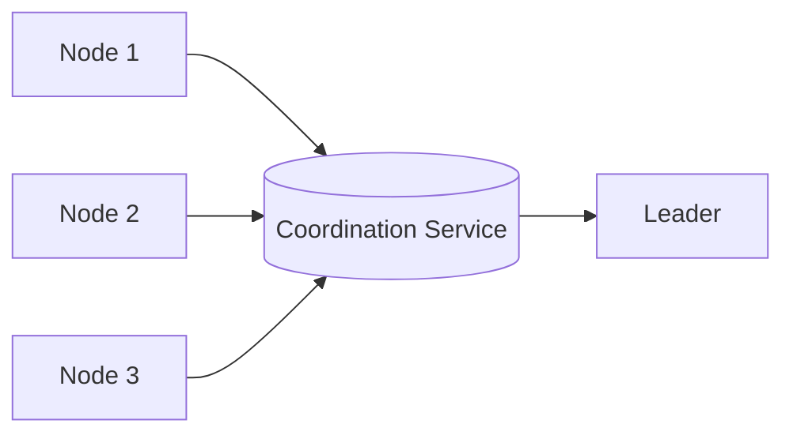

# Leader Election

## 0) Metadata
- **Name**: Leader Election
- **Canonical Path**: Patterns/003_DistributedSystems/DistributedCoordination/Leader_Election.md
- **Category**: 003 Distributed Systems
- **Status**: Stable
- **Last Updated**: YYYY-MM-DD
- **Tags**: leader, election, coordinator, zookeeper, etcd

---

## 1) TL;DR (Executive Summary)
- **Problem**: Choose a single coordinator among multiple nodes.
- **Solution (essence)**: Use a coordination service (ZooKeeper/etcd/consul) or consensus-based election to pick a unique leader with liveness guarantees.

---

## 2) Approaches
- External coordinator with ephemeral nodes and watches (ZooKeeper, etcd).
- Bully or ring algorithms (in-process) for small clusters.
- Raft leader election as part of consensus.

## 3) Architecture

---

## 4) Properties & Guarantees
- Single active leader (under failure assumptions); fencing tokens prevent split-brain.
- Watchers notified on leader change.

---

## 5) Tradeoffs
- External dependency; latency to elect.
- Simpler than rolling your own election protocol.

---

## 6) Implementation Notes
- Use leases/TTLs and fencing tokens on shared resources.
- Avoid thundering herd on re-election; randomize backoff.

---

## 7) References
- ZooKeeper recipes; etcd lease/lock APIs; Raft leader election.
