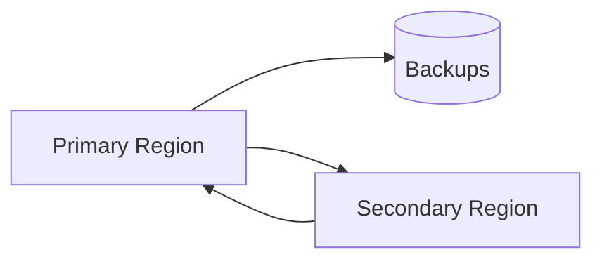

# Disaster Recovery (DR)

## 0) Metadata
- **Name**: Disaster Recovery
- **Canonical Path**: Patterns/003_DistributedSystems/FaultTolerance/Disaster_Recovery.md
- **Category**: 003 Distributed Systems
- **Status**: Stable
- **Last Updated**: YYYY-MM-DD
- **Tags**: dr, rto, rpo, backups, failover, multi-region

---

## 1) TL;DR (Executive Summary)
- **Problem**: Regional outages or data loss events must not be catastrophic.
- **Solution (essence)**: Define RPO/RTO, maintain backups/replicas, and rehearse failover/failback.

---

## 2) Strategy
- Backups: encrypted, tested restores, retention.
- Replication: cross-region; async or sync per RPO.
- Runbooks: automated cutover, DNS steering, data validation.

## 3) Architecture

---

## 4) Properties & Tradeoffs
- Lower RPO implies higher cost/latency (sync); async cheaper but riskier.
- DR drills required to ensure readiness; stale configs drift otherwise.

---

## 5) Implementation Notes
- Classify apps by tier; map to RPO/RTO; test quarterly.
- Protect backups (immutable storage/WORM); practice restores.

---

## 6) References
- SRE Book (Disaster Recovery), cloud vendor DR patterns.
