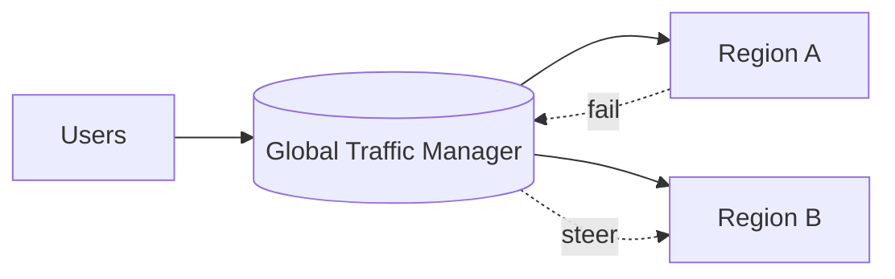

# Failover Strategies

## 0) Metadata
- **Name**: Failover Strategies
- **Canonical Path**: Patterns/003_DistributedSystems/FaultTolerance/Failover_Strategies.md
- **Category**: 003 Distributed Systems
- **Status**: Stable
- **Last Updated**: YYYY-MM-DD
- **Tags**: failover, active-passive, active-active, rto, rpo

---

## 1) TL;DR (Executive Summary)
- **Problem**: Components fail; traffic must move to healthy capacity with minimal disruption.
- **Solution (essence)**: Automated detection and switchover (active-passive) or continuous multi-active with traffic steering.

---

## 2) Approaches
- Active-passive: promote standby on failure; DNS or control-plane switch.
- Active-active: traffic split; health-aware steering (geo, anycast, LB).

## 3) Architecture

---

## 4) Properties & Tradeoffs
- RTO/RPO targets drive design; active-active higher cost but faster recovery.
- Split-brain risks; ensure safe single-writer policies.

---

## 5) Implementation Notes
- Health checks and SLO-aware thresholds; avoid flapping.
- Runbooks and drills; automate as much as possible.

---

## 6) References
- SRE Book; multi-region design guides; DNS failover docs.
