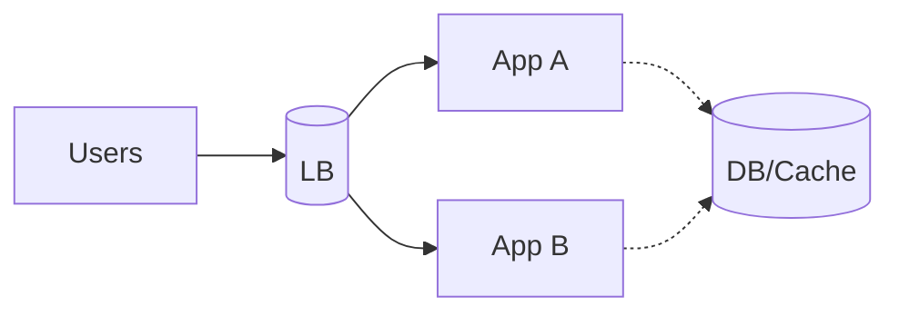

# Redundancy

## 0) Metadata
- **Name**: Redundancy
- **Canonical Path**: Patterns/003_DistributedSystems/FaultTolerance/Redundancy.md
- **Category**: 003 Distributed Systems
- **Status**: Stable
- **Last Updated**: YYYY-MM-DD
- **Tags**: redundancy, n+1, multi-az, replication

---

## 1) TL;DR (Executive Summary)
- **Problem**: Single components fail; we need resilience.
- **Solution (essence)**: Duplicate critical components (N+1, active-active/passive) across failure domains.

---

## 2) Forms
- Hardware: multiple power/ NICs.
- Compute: multiple instances; AZ/region redundancy.
- Data: replicas, erasure coding.

## 3) Architecture

---

## 4) Properties & Tradeoffs
- Higher availability; cost overhead; complexity in failover and consistency.

---

## 5) Implementation Notes
- Independence: avoid correlated failures (same rack/AZ).
- Test failovers; automate detection and switchover.

---

## 6) References
- SRE Book; AWS Well-Architected Framework.
