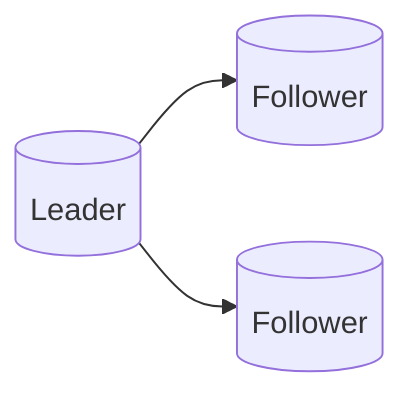

# Replication

## 0) Metadata
- **Name**: Replication
- **Canonical Path**: Patterns/003_DistributedSystems/FaultTolerance/Replication.md
- **Category**: 003 Distributed Systems
- **Status**: Stable
- **Last Updated**: YYYY-MM-DD
- **Tags**: replication, sync, async, quorum

---

## 1) TL;DR (Executive Summary)
- **Problem**: Single copy of state is fragile and slow for global users.
- **Solution (essence)**: Maintain multiple copies with a defined replication and read/write policy.

---

## 2) Models
- Sync vs async; semi-sync.
- Single-leader, multi-leader, leaderless.

## 3) Architecture

---

## 4) Properties & Tradeoffs
- Sync: lower RPO, higher latency.
- Async: better write latency, risk of loss on failover.
- Quorums balance latency and staleness.

---

## 5) Implementation Notes
- Set replication factor; monitor lag; enforce min.insync on writes.
- Plan failover detection, fencing, and promotion.

---

## 6) References
- See Data_Replication_Consistency; vendor docs.
