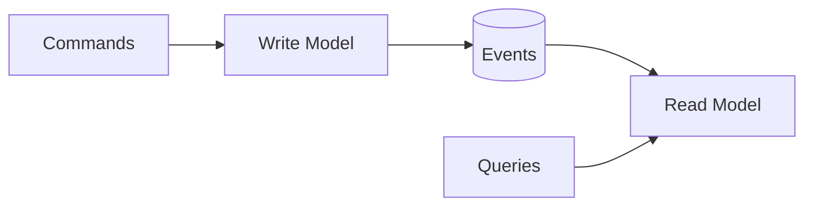

# CQRS (Command Query Responsibility Segregation)

## 0) Metadata
- **Name**: CQRS
- **Canonical Path**: Patterns/004_ArchitecturalPatterns/CQRS.md
- **Category**: 004 Architectural Patterns
- **Status**: Stable
- **Last Updated**: YYYY-MM-DD
- **Tags**: cqrs, write-model, read-model, eventual-consistency

---

## 1) TL;DR (Executive Summary)
- **Problem**: Unified models struggle to satisfy both write correctness and read performance.
- **Solution (essence)**: Separate write (commands) and read (queries) models; propagate changes asynchronously.
- **Use when**: High read/write asymmetry, complex writes, different scaling needs.
- **Key tradeoff**: Eventual consistency between write and read models.

---

## 2) Architecture

---

## 3) Properties & Tradeoffs
| Aspect | Pros | Cons | Notes |
|---|---|---|---|
| Writes | Clean invariants | Async projection lag | Use outbox |
| Reads | Tailored for fast queries | Duplication | Materialized views |
| Scale | Independent | Consistency mgmt | Backfill/rebuild tooling |

---

## 4) Implementation Guide
- Define write invariants and events; schema for read stores.
- Use outbox to publish events post-commit; idempotent projections.
- Backfill and rebuild processes for read models.

---

## 5) References
- Greg Young’s CQRS; Enterprise patterns; DDIA.
