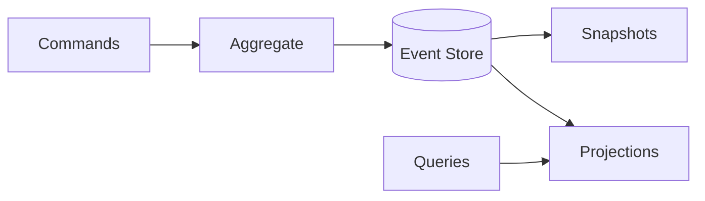

# Event Sourcing

## 0) Metadata
- **Name**: Event Sourcing
- **Canonical Path**: Patterns/004_ArchitecturalPatterns/Event_Sourcing.md
- **Category**: 004 Architectural Patterns
- **Status**: Stable
- **Last Updated**: YYYY-MM-DD
- **Tags**: event-sourcing, aggregate, snapshot, audit

---

## 1) TL;DR (Executive Summary)
- **Problem**: Need complete audit history and ability to reconstruct state changes.
- **Solution (essence)**: Store all changes as an append-only sequence of domain events; reconstruct state by replaying events.
- **Use when**: Auditability, temporal queries, complex invariants; pairs well with CQRS.
- **Key tradeoff**: Event schema evolution and projections add complexity.

---

## 2) Architecture

---

## 3) Properties & Tradeoffs
| Aspect | Pros | Cons | Notes |
|---|---|---|---|
| Audit | Full history | Storage growth | Compact via snapshots |
| Recovery | Rebuild state | Replay time | Snapshot + snapshotting |
| Scale | Append-only | Query via projections | Use stream partitions |

---

## 4) Implementation Guide
- Design immutable event schemas; use upcasting for evolution.
- Snapshots to speed recovery; periodic or size-based.
- Projections are idempotent; handle replays.

---

## 5) References
- Event Sourcing (Fowler/Greg Young); Kafka + event sourcing patterns.
