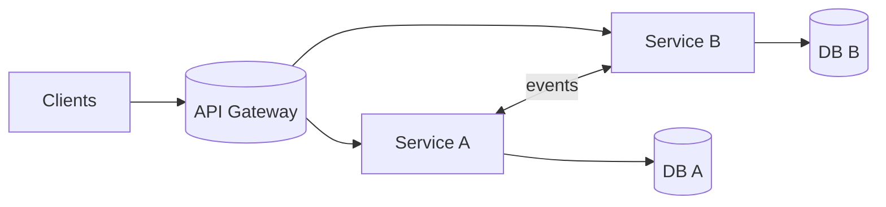

# Microservices

## 0) Metadata
- **Name**: Microservices
- **Canonical Path**: Patterns/004_ArchitecturalPatterns/Microservices.md
- **Category**: 004 Architectural Patterns
- **Status**: Stable
- **Last Updated**: YYYY-MM-DD
- **Tags**: microservices, decentralization, scaling, autonomy

---

## 1) TL;DR (Executive Summary)
- **Problem**: Monoliths hinder independent scaling, deployments, and team autonomy.
- **Solution (essence)**: Decompose into independently deployable services with clear boundaries and contracts.
- **Use when**: Multiple teams, distinct domains, need for independent scaling/changes.
- **Key tradeoff**: Team autonomy vs distributed systems complexity.

---

## 2) Principles
- Bounded contexts (DDD), strong contracts (APIs/events), decentralized data.
- Autonomy: own code, data, deploy; avoid shared databases.
- Resilience: bulkheads, timeouts, retries, circuit breakers.

## 3) Architecture

---

## 4) Properties & Tradeoffs
| Aspect | Pros | Cons | Notes |
|---|---|---|---|
| Autonomy | Independent deploy/scale | Cross-service coordination | Sagas for consistency |
| Reliability | Fault isolation | More failure modes | Resilience patterns |
| Velocity | Team ownership | Platform/ops overhead | Invest in platform |

---

## 5) Implementation Guide
- Platform: service templates, CI/CD, observability, service mesh (optional).
- Contracts: API specs, event schemas, compatibility policy.
- Data: database-per-service; avoid cross-service joins; use async integration.
- Governance: minimal standards (logging, metrics, authn/z).

---

## 6) Pitfalls & Edge Cases
- Distributed transactions; prefer sagas/compensation.
- Chattiness and N+1 service calls; use BFF/aggregation.
- Orphaned services; clear ownership and SLAs.

---

## 7) References
- Building Microservices (Newman); Microservices patterns (Richardson); SRE/SOAs.
