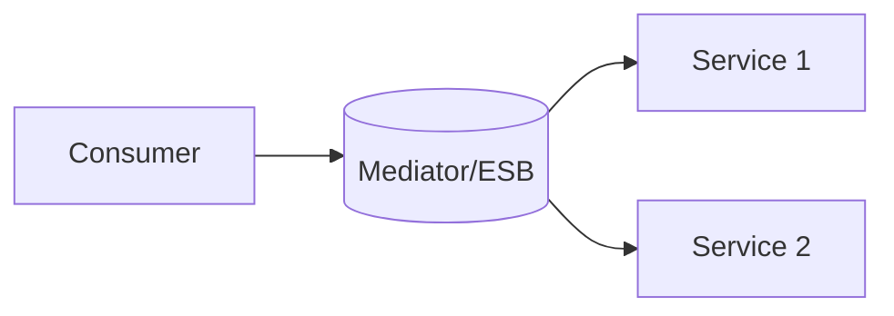

# Service-Oriented Architecture (SOA)

## 0) Metadata
- **Name**: Service-Oriented Architecture
- **Canonical Path**: Patterns/004_ArchitecturalPatterns/Service_Oriented_Architecture.md
- **Category**: 004 Architectural Patterns
- **Status**: Stable
- **Last Updated**: YYYY-MM-DD
- **Tags**: soa, services, esb, contracts

---

## 1) TL;DR (Executive Summary)
- **Problem**: Monolithic integration limits reuse and agility across enterprise systems.
- **Solution (essence)**: Compose applications from reusable, loosely coupled services communicating via contracts.
- **Use when**: Enterprise integration, heterogeneous stacks, reuse across domains.
- **Key tradeoff**: Governance and ESB complexity vs reuse and standardization.

---

## 2) Concepts
- Services expose contracts; registries/discovery; mediation (ESB) for routing/transform.
- Standards: SOAP/WSDL/WS-* historically; modern SOA uses REST/gRPC/event buses.

## 3) Architecture

---

## 4) Properties & Tradeoffs
| Aspect | Pros | Cons | Notes |
|---|---|---|---|
| Reuse | High | Mediation overhead | Contract-first |
| Governance | Standards | Bureaucracy | Balance vs agility |
| Coupling | Loose | ESB bottlenecks | Prefer lightweight mediation |

---

## 5) Implementation Guide
- Define contracts and SLAs; versioning; backward compatibility.
- Avoid centralized ESB as a chokepoint; prefer smart endpoints/dumb pipes.

---

## 6) References
- Enterprise Integration Patterns; SOA books; ESB docs.
